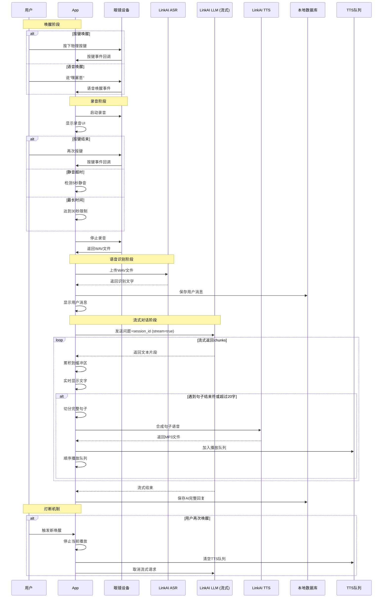
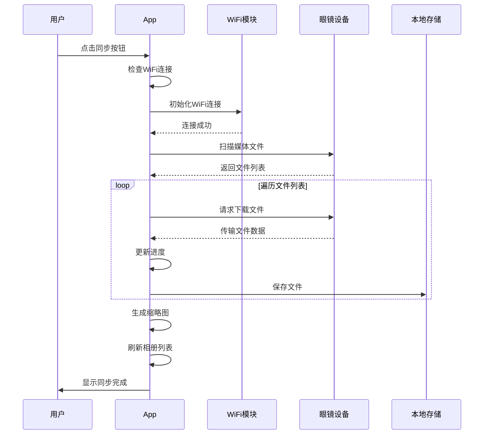
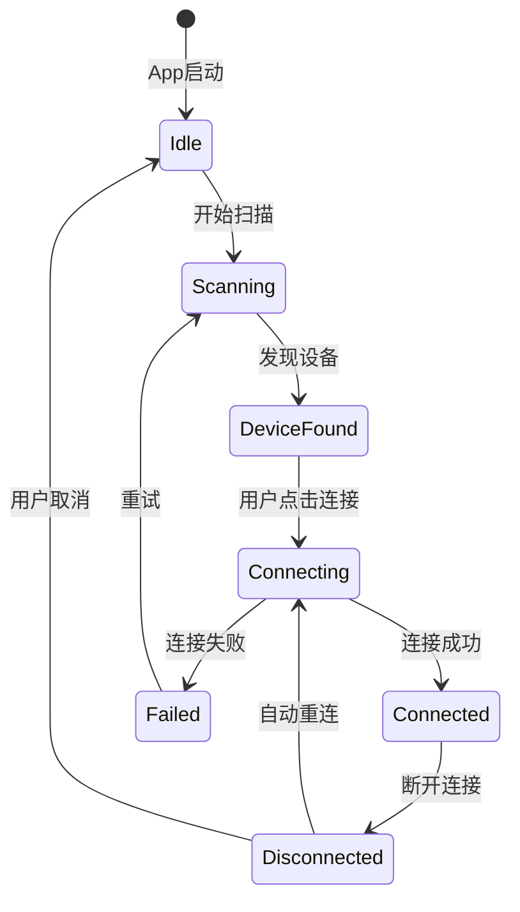
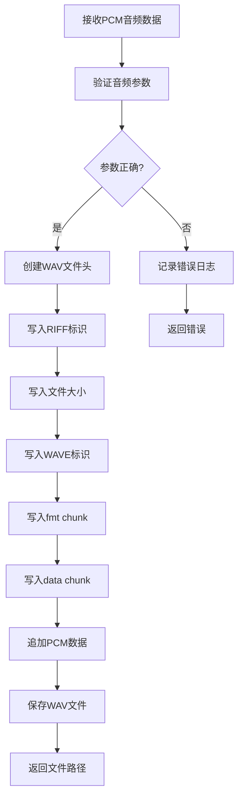

# 青橙AI眼镜Android App 设计文档

**项目**: 青橙AI眼镜Android App (MVP)
**版本**: V1.0
**日期**: 2026-03-16
**状态**: 设计阶段

---

## 概述

青橙AI眼镜Android App是一款为青橙无线AR眼镜开发的配套手机控制应用。该应用通过蓝牙和WiFi与眼镜设备通信，提供设备连接管理、媒体采集控制、AI语音对话、媒体同步管理等核心功能。

**项目定位**: 本项目是MVP阶段，专注于基础对话和设备控制能力。后续将集成OpenClaw（开源AI自动化代理引擎），使眼镜从"语音控制工具"升级为具备自主执行能力的"AI数字助手"。

### 核心价值

- **便捷控制**: 一键触发眼镜拍照、录像、录音等功能
- **AI助手**: 集成LinkAI平台，实现语音识别、对话生成、语音合成的完整AI对话体验
- **媒体管理**: 通过WiFi自动同步眼镜拍摄内容到手机，支持浏览和管理
- **未来扩展**: 预留OpenClaw集成接口，支持任务自动化和技能生态

### 技术栈

| 层级 | 技术选型 | 说明 |
|------|----------|------|
| 开发语言 | Kotlin | Android官方推荐语言，与官方SDK demo保持一致 |
| UI框架 | Jetpack Compose | 现代化声明式UI框架 |
| 网络库 | Retrofit + OkHttp | HTTP请求和API调用 |
| 数据库 | Room | 本地会话和消息存储 |
| 蓝牙SDK | 青橙SDK (LIB_GLASSES_SDK-release.aar) | 眼镜设备控制 |
| AI服务 | LinkAI API | ASR + LLM + TTS |
| 图片加载 | Coil | 媒体缩略图加载和缓存 |
| 权限管理 | XXPermissions | 运行时权限请求（与官方demo一致） |
| 事件总线 | EventBus | 组件间通信 |
| 未来扩展 | OpenClaw Lite | 轻量级任务执行引擎（Phase 2） |

### 系统要求

- **最低SDK版本**: Android 7.0 (API 24)
- **目标SDK版本**: Android 14 (API 35)
- **开发工具**: Android Studio Hedgehog | 2023.1.1 或更高版本

---

## 架构

### 系统架构图


```
┌─────────────────────────────────────────────────────────────────────┐
│                          手机端 (Android App)                        │
│                                                                      │
│  ┌────────────────────────────────────────────────────────────────┐ │
│  │                         UI 层 (Jetpack Compose)                 │ │
│  │  ┌──────────┐  ┌──────────┐  ┌──────────┐  ┌──────────┐       │ │
│  │  │  首页    │  │ AI对话页 │  │  相册页  │  │  我的页  │       │ │
│  │  │ (Home)   │  │ (Chat)   │  │(Gallery) │  │(Profile) │       │ │
│  │  └──────────┘  └──────────┘  └──────────┘  └──────────┘       │ │
│  └────────────────────────────────────────────────────────────────┘ │
│                                 │                                    │
│  ┌────────────────────────────────────────────────────────────────┐ │
│  │                        业务逻辑层 (ViewModel)                   │ │
│  │  ┌──────────────┐  ┌──────────────┐  ┌──────────────┐         │ │
│  │  │ 蓝牙连接管理 │  │ AI对话管理   │  │ 媒体同步管理 │         │ │
│  │  │ (Bluetooth)  │  │ (AI Service) │  │ (Media Sync) │         │ │
│  │  └──────────────┘  └──────────────┘  └──────────────┘         │ │
│  └────────────────────────────────────────────────────────────────┘ │
│                                 │                                    │
│  ┌────────────────────────────────────────────────────────────────┐ │
│  │                        管理器层 (Managers)                      │ │
│  │  ┌──────────────┐  ┌──────────────┐  ┌──────────────┐         │ │
│  │  │ 唤醒管理器   │  │ 录音管理器   │  │流式对话管理器│         │ │
│  │  │ (Wakeup)     │  │ (Recording)  │  │ (Streaming)  │         │ │
│  │  └──────────────┘  └──────────────┘  └──────────────┘         │ │
│  │  ┌──────────────┐  ┌──────────────┐  ┌──────────────┐         │ │
│  │  │临时文件管理器│  │  TTS队列     │  │ 音频播放器   │         │ │
│  │  │ (TempFile)   │  │ (TTSQueue)   │  │ (AudioPlayer)│         │ │
│  │  └──────────────┘  └──────────────┘  └──────────────┘         │ │
│  └────────────────────────────────────────────────────────────────┘ │
│                                 │                                    │
│  ┌────────────────────────────────────────────────────────────────┐ │
│  │                        数据层 (Repository)                      │ │
│  │  ┌──────────────┐  ┌──────────────┐  ┌──────────────┐         │ │
│  │  │  青橙SDK     │  │  LinkAI API  │  │  Room数据库  │         │ │
│  │  │  (BLE/WiFi)  │  │  (Network)   │  │  (Local DB)  │         │ │
│  │  └──────────────┘  └──────────────┘  └──────────────┘         │ │
│  └────────────────────────────────────────────────────────────────┘ │
│                                 │                                    │
│  ┌────────────────────────────────────────────────────────────────┐ │
│  │                    服务层 (Foreground Service)                  │ │
│  │  ┌──────────────────────────────────────────────────┐          │ │
│  │  │  前台服务 (保持蓝牙连接 + 语音唤醒监听)          │          │ │
│  │  └──────────────────────────────────────────────────┘          │ │
│  └────────────────────────────────────────────────────────────────┘ │
└─────────────────────────────────────────────────────────────────────┘
             │                              │
             ▼                              ▼
  ┌─────────────────────┐      ┌─────────────────────────────┐
  │    眼镜设备          │      │      LinkAI云平台            │
  │  - 蓝牙通信          │      │  - ASR (语音→文字)          │
  │  - WiFi文件传输      │      │  - LLM (对话生成+记忆)      │
  │  - 按键事件          │      │  - TTS (文字→语音)          │
  │  - 语音唤醒("嘿塞恩")│      └─────────────────────────────┘
  │  - 扬声器播放        │
  └─────────────────────┘
```

### 分层架构说明

#### 1. UI层 (Presentation Layer)

采用Jetpack Compose构建声明式UI，包含四个主要页面：

- **首页 (HomeScreen)**: 设备连接状态、电量显示、快捷功能按钮
- **AI对话页 (ChatScreen)**: 对话消息列表、语音输入按钮、历史记录入口
- **相册页 (GalleryScreen)**: 媒体文件网格展示、同步按钮、类型筛选
- **我的页 (ProfileScreen)**: 用户信息、设置选项、关于信息


#### 2. 业务逻辑层 (Business Logic Layer)

使用ViewModel管理UI状态和业务逻辑：

- **BluetoothViewModel**: 管理设备扫描、连接、断开、状态监听
- **ChatViewModel**: 管理对话流程、消息列表、会话切换
- **GalleryViewModel**: 管理媒体同步、文件列表、类型筛选
- **ProfileViewModel**: 管理用户设置、版本信息

#### 3. 数据层 (Data Layer)

- **青橙SDK封装**: 封装蓝牙和WiFi通信逻辑
- **LinkAI API客户端**: 封装ASR、LLM、TTS接口调用
- **Room数据库**: 存储会话和消息数据

### 模块划分

```
com.glasses.app
├── ui/                          # UI层
│   ├── home/                    # 首页模块
│   ├── chat/                    # AI对话模块
│   ├── gallery/                 # 相册模块
│   └── profile/                 # 我的页模块
├── viewmodel/                   # ViewModel层
│   ├── BluetoothViewModel.kt
│   ├── ChatViewModel.kt
│   ├── GalleryViewModel.kt
│   └── ProfileViewModel.kt
├── data/                        # 数据层
│   ├── repository/              # 数据仓库
│   ├── local/                   # 本地数据源
│   │   ├── db/                  # Room数据库
│   │   └── prefs/               # SharedPreferences
│   └── remote/                  # 远程数据源
│       ├── sdk/                 # 青橙SDK封装
│       └── api/                 # LinkAI API
├── domain/                      # 领域层
│   ├── model/                   # 数据模型
│   └── usecase/                 # 业务用例
├── service/                     # 服务层
│   ├── GlassesConnectionService.kt  # 前台服务
│   └── wakeup/                  # 唤醒模块
│       ├── WakeupManager.kt
│       ├── ButtonWakeupHandler.kt
│       └── VoiceWakeupHandler.kt
├── manager/                     # 管理器层
│   ├── RecordingManager.kt      # 录音管理
│   ├── StreamingChatManager.kt  # 流式对话管理
│   ├── TempFileManager.kt       # 临时文件管理
│   ├── TTSQueue.kt              # TTS队列
│   └── AudioPlayer.kt           # 音频播放器
└── util/                        # 工具类（复用官方demo）
    ├── AudioConverter.kt        # PCM→WAV转换
    ├── PermissionUtil.kt        # 权限管理（复用官方demo）
    ├── BluetoothUtils.kt        # 蓝牙工具（复用官方demo）
    ├── ActivityExt.kt           # Activity扩展（复用官方demo）
    ├── HuaweiProtectedAppsHelper.kt  # 华为保活
    ├── BatteryOptimizationHelper.kt  # 电池优化
    └── Logger.kt                # 日志工具
```

**复用策略说明**:
- `util/` 目录下标注"复用官方demo"的文件，直接从官方SDK demo复制
- `data/remote/sdk/` 目录参考官方demo的SDK调用模式
- Application初始化流程参考官方demo的`MyApplication.kt`

---

## 组件和接口

### 核心组件

#### 1. 蓝牙连接模块 (BluetoothModule)

**职责**: 管理眼镜设备的蓝牙连接生命周期

**主要接口**:

```kotlin
interface BluetoothManager {
    // 扫描设备
    fun startScan(callback: (List<BluetoothDevice>) -> Unit)
    
    // 停止扫描
    fun stopScan()
    
    // 连接设备
    suspend fun connect(device: BluetoothDevice): Result<Unit>
    
    // 断开连接
    suspend fun disconnect(): Result<Unit>
    
    // 获取连接状态
    fun getConnectionState(): Flow<ConnectionState>
    
    // 获取电量
    suspend fun getBatteryLevel(): Result<Int>
    
    // 发送控制指令
    suspend fun sendCommand(command: GlassesCommand): Result<Unit>
}
```

**依赖的SDK API**:
- `BleScannerHelper.scanDevice()`
- `BleOperateManager.connectDirectly()`
- `BleOperateManager.unBindDevice()`
- `LargeDataHandler.syncBattery()`
- `GlassesDeviceNotifyListener`


#### 2. AI对话模块 (AIModule)

**职责**: 处理完整的AI对话流程（ASR → LLM → TTS）

**主要接口**:

```kotlin
interface AIService {
    // 语音识别
    suspend fun transcribeAudio(audioFile: File): Result<String>
    
    // 对话生成
    suspend fun chat(
        question: String,
        sessionId: String,
        appCode: String
    ): Result<ChatResponse>
    
    // 语音合成
    suspend fun synthesizeSpeech(
        text: String,
        voice: String
    ): Result<File>
    
    // 完整对话流程
    suspend fun processVoiceInput(
        audioFile: File,
        sessionId: String
    ): Flow<ChatState>
}

data class ChatResponse(
    val sessionId: String,
    val content: String,
    val usage: TokenUsage
)

sealed class ChatState {
    object Recording : ChatState()
    data class Transcribing(val progress: Float) : ChatState()
    data class Transcribed(val text: String) : ChatState()
    data class Generating(val progress: Float) : ChatState()
    data class Generated(val response: String) : ChatState()
    data class Synthesizing(val progress: Float) : ChatState()
    data class Completed(val audioFile: File) : ChatState()
    data class Error(val message: String) : ChatState()
}
```

**依赖的LinkAI API**:
- `POST /v1/audio/transcriptions` (ASR)
- `POST /v1/chat/memory/completions` (LLM)
- `POST /v1/audio/speech` (TTS)

#### 3. 媒体同步模块 (MediaSyncModule)

**职责**: 通过WiFi同步眼镜上的媒体文件

**主要接口**:

```kotlin
interface MediaSyncManager {
    // 初始化同步
    suspend fun initSync(downloadPath: String): Result<Unit>
    
    // 开始同步
    suspend fun startSync(): Flow<SyncProgress>
    
    // 取消同步
    fun cancelSync()
    
    // 获取本地媒体列表
    suspend fun getLocalMedia(type: MediaType? = null): List<MediaFile>
    
    // 删除本地媒体
    suspend fun deleteMedia(file: MediaFile): Result<Unit>
}

data class SyncProgress(
    val currentFile: String,
    val currentProgress: Int,
    val totalFiles: Int,
    val completedFiles: Int
)

enum class MediaType {
    PHOTO, VIDEO, AUDIO
}

data class MediaFile(
    val id: String,
    val name: String,
    val path: String,
    val type: MediaType,
    val size: Long,
    val timestamp: Long,
    val thumbnailPath: String? = null
)
```

**依赖的SDK API**:
- `GlassesControl.initGlasses(path)`
- `GlassesControl.importAlbum()`
- `WifiFilesDownloadListener`


#### 4. 会话管理模块 (ConversationModule)

**职责**: 管理AI对话的会话和消息存储

**主要接口**:

```kotlin
interface ConversationRepository {
    // 创建新会话
    suspend fun createConversation(title: String): Conversation
    
    // 获取所有会话
    fun getAllConversations(): Flow<List<Conversation>>
    
    // 获取会话详情
    suspend fun getConversation(id: String): Conversation?
    
    // 删除会话
    suspend fun deleteConversation(id: String)
    
    // 添加消息
    suspend fun addMessage(message: Message)
    
    // 获取会话的所有消息
    fun getMessages(conversationId: String): Flow<List<Message>>
    
    // 更新会话时间
    suspend fun updateConversationTime(id: String)
}

data class Conversation(
    val id: String,
    val title: String,
    val createdAt: Long,
    val updatedAt: Long
)

data class Message(
    val id: String,
    val conversationId: String,
    val role: MessageRole,
    val content: String,
    val audioPath: String? = null,
    val createdAt: Long
)

enum class MessageRole {
    USER, ASSISTANT
}
```

#### 5. 唤醒模块 (WakeupModule)

**职责**: 管理按键唤醒和语音唤醒两种唤醒方式

**主要接口**:

```kotlin
interface WakeupManager {
    // 注册按键唤醒监听
    fun registerButtonWakeup(callback: () -> Unit)
    
    // 注册语音唤醒监听
    fun registerVoiceWakeup(callback: () -> Unit)
    
    // 启用/禁用语音唤醒
    suspend fun setVoiceWakeupEnabled(enabled: Boolean): Result<Unit>
    
    // 获取语音唤醒状态
    fun isVoiceWakeupEnabled(): Boolean
    
    // 取消所有监听
    fun unregisterAll()
}

// 按键唤醒处理器
class ButtonWakeupHandler(private val sdkManager: GlassesSDKManager) {
    private var lastClickTime = 0L
    private val debounceDelay = 200L // 防抖延迟200ms
    
    fun handleButtonClick(callback: () -> Unit) {
        val currentTime = System.currentTimeMillis()
        if (currentTime - lastClickTime > debounceDelay) {
            lastClickTime = currentTime
            callback()
        }
    }
}

// 语音唤醒处理器
class VoiceWakeupHandler(private val sdkManager: GlassesSDKManager) {
    private val wakeupWord = "嘿塞恩" // 固定唤醒词
    
    fun registerListener(callback: () -> Unit) {
        // 注册SDK的语音唤醒事件监听
        sdkManager.registerVoiceWakeupListener { wakeupEvent ->
            if (wakeupEvent.keyword == wakeupWord) {
                callback()
            }
        }
    }
}
```

**唤醒流程统一处理**:

```kotlin
class WakeupCoordinator(
    private val buttonHandler: ButtonWakeupHandler,
    private val voiceHandler: VoiceWakeupHandler,
    private val recordingManager: RecordingManager
) {
    fun initialize() {
        // 统一处理两种唤醒方式
        val wakeupCallback = {
            handleWakeup()
        }
        
        buttonHandler.handleButtonClick(wakeupCallback)
        voiceHandler.registerListener(wakeupCallback)
    }
    
    private fun handleWakeup() {
        // 启动录音
        recordingManager.startRecording()
        // 更新UI状态
        updateUIState(WakeupState.RECORDING)
    }
}
```

#### 6. 录音管理器 (RecordingManager)

**职责**: 管理眼镜端录音的启动、停止和文件下载

**主要接口**:

```kotlin
interface RecordingManager {
    // 开始录音
    suspend fun startRecording(): Result<Unit>
    
    // 停止录音（手动）
    suspend fun stopRecording(): Result<File>
    
    // 设置录音参数
    fun setRecordingConfig(config: RecordingConfig)
    
    // 获取录音状态
    fun getRecordingState(): Flow<RecordingState>
}

data class RecordingConfig(
    val maxDuration: Long = 30_000L, // 最长录音时间30秒
    val silenceTimeout: Long = 5_000L, // 静音超时5秒
    val enableSilenceDetection: Boolean = true
)

sealed class RecordingState {
    object Idle : RecordingState()
    object Recording : RecordingState()
    data class Processing(val progress: Float) : RecordingState()
    data class Completed(val audioFile: File) : RecordingState()
    data class Error(val message: String) : RecordingState()
}

// 录音管理器实现
class RecordingManagerImpl(
    private val sdkManager: GlassesSDKManager,
    private val context: Context
) : RecordingManager {
    
    private var recordingStartTime = 0L
    private var silenceStartTime = 0L
    private val config = RecordingConfig()
    
    override suspend fun startRecording(): Result<Unit> {
        return try {
            sdkManager.glassesControl.startRecording()
            recordingStartTime = System.currentTimeMillis()
            
            // 启动监控协程
            startRecordingMonitor()
            
            Result.success(Unit)
        } catch (e: Exception) {
            Result.failure(e)
        }
    }
    
    private fun startRecordingMonitor() {
        CoroutineScope(Dispatchers.IO).launch {
            while (true) {
                delay(100)
                
                val duration = System.currentTimeMillis() - recordingStartTime
                
                // 检查最长时间限制
                if (duration >= config.maxDuration) {
                    stopRecording()
                    break
                }
                
                // 检查静音超时
                if (config.enableSilenceDetection && isSilent()) {
                    if (silenceStartTime == 0L) {
                        silenceStartTime = System.currentTimeMillis()
                    } else if (System.currentTimeMillis() - silenceStartTime >= config.silenceTimeout) {
                        stopRecording()
                        break
                    }
                } else {
                    silenceStartTime = 0L
                }
            }
        }
    }
    
    override suspend fun stopRecording(): Result<File> {
        return try {
            sdkManager.glassesControl.stopRecording()
            
            // 下载录音文件
            val audioFile = downloadLatestRecording()
            
            Result.success(audioFile)
        } catch (e: Exception) {
            Result.failure(e)
        }
    }
    
    private suspend fun downloadLatestRecording(): File {
        val tempDir = File(context.cacheDir, "recordings")
        if (!tempDir.exists()) tempDir.mkdirs()
        
        val audioFile = File(tempDir, "recording_${System.currentTimeMillis()}.wav")
        
        // 通过SDK下载最新录音
        sdkManager.glassesControl.importAlbum()
        // 假设SDK返回文件路径或流，保存到audioFile
        
        return audioFile
    }
    
    private fun isSilent(): Boolean {
        // 通过SDK获取音频电平，判断是否静音
        // 这里需要SDK提供实时音频电平接口
        return false
    }
}
```

#### 7. 流式对话管理器 (StreamingChatManager)

**职责**: 管理流式对话、攒句播报和打断机制

**主要接口**:

```kotlin
interface StreamingChatManager {
    // 开始流式对话
    suspend fun startStreamingChat(
        question: String,
        sessionId: String
    ): Flow<StreamingChatState>
    
    // 停止当前对话（打断）
    fun interrupt()
    
    // 获取TTS队列状态
    fun getTTSQueueState(): Flow<TTSQueueState>
}

sealed class StreamingChatState {
    object Idle : StreamingChatState()
    data class Streaming(val partialText: String) : StreamingChatState()
    data class SentenceReady(val sentence: String) : StreamingChatState()
    data class AudioReady(val audioFile: File) : StreamingChatState()
    data class Playing(val sentence: String) : StreamingChatState()
    data class Completed(val fullText: String) : StreamingChatState()
    data class Error(val message: String) : StreamingChatState()
}

data class TTSQueueState(
    val queueSize: Int,
    val currentPlaying: String?,
    val isPlaying: Boolean
)

// 流式对话管理器实现
class StreamingChatManagerImpl(
    private val aiService: AIService,
    private val ttsQueue: TTSQueue,
    private val audioPlayer: AudioPlayer
) : StreamingChatManager {
    
    private val sentenceBuffer = StringBuilder()
    private val sentenceEndMarkers = setOf('。', '！', '？', '.', '!', '?')
    private val maxBufferLength = 20
    
    private var currentJob: Job? = null
    
    override suspend fun startStreamingChat(
        question: String,
        sessionId: String
    ): Flow<StreamingChatState> = flow {
        emit(StreamingChatState.Idle)
        
        try {
            // 调用流式对话接口
            aiService.chatStreaming(question, sessionId).collect { chunk ->
                // 累积文本到缓冲区
                sentenceBuffer.append(chunk)
                emit(StreamingChatState.Streaming(sentenceBuffer.toString()))
                
                // 检查是否可以切分句子
                val sentence = tryExtractSentence()
                if (sentence != null) {
                    emit(StreamingChatState.SentenceReady(sentence))
                    
                    // 异步调用TTS
                    val audioFile = aiService.synthesizeSpeech(sentence, "BV700_V2_streaming")
                    if (audioFile.isSuccess) {
                        val file = audioFile.getOrThrow()
                        ttsQueue.enqueue(sentence, file)
                        emit(StreamingChatState.AudioReady(file))
                    }
                }
            }
            
            // 处理剩余缓冲区内容
            if (sentenceBuffer.isNotEmpty()) {
                val lastSentence = sentenceBuffer.toString()
                emit(StreamingChatState.SentenceReady(lastSentence))
                
                val audioFile = aiService.synthesizeSpeech(lastSentence, "BV700_V2_streaming")
                if (audioFile.isSuccess) {
                    val file = audioFile.getOrThrow()
                    ttsQueue.enqueue(lastSentence, file)
                    emit(StreamingChatState.AudioReady(file))
                }
            }
            
            emit(StreamingChatState.Completed(sentenceBuffer.toString()))
            
        } catch (e: Exception) {
            emit(StreamingChatState.Error(e.message ?: "Unknown error"))
        }
    }
    
    private fun tryExtractSentence(): String? {
        val text = sentenceBuffer.toString()
        
        // 查找句子结束符
        for (i in text.indices) {
            if (text[i] in sentenceEndMarkers) {
                val sentence = text.substring(0, i + 1)
                sentenceBuffer.delete(0, i + 1)
                return sentence
            }
        }
        
        // 如果超过最大长度，强制切分
        if (text.length >= maxBufferLength) {
            val sentence = text.substring(0, maxBufferLength)
            sentenceBuffer.delete(0, maxBufferLength)
            return sentence
        }
        
        return null
    }
    
    override fun interrupt() {
        // 停止当前流式请求
        currentJob?.cancel()
        
        // 清空TTS队列
        ttsQueue.clear()
        
        // 停止音频播放
        audioPlayer.stop()
        
        // 清空缓冲区
        sentenceBuffer.clear()
    }
}

// TTS队列管理
class TTSQueue {
    private val queue = mutableListOf<TTSItem>()
    private val _state = MutableStateFlow(TTSQueueState(0, null, false))
    val state: StateFlow<TTSQueueState> = _state.asStateFlow()
    
    data class TTSItem(val sentence: String, val audioFile: File)
    
    fun enqueue(sentence: String, audioFile: File) {
        queue.add(TTSItem(sentence, audioFile))
        updateState()
    }
    
    fun dequeue(): TTSItem? {
        return if (queue.isNotEmpty()) {
            queue.removeAt(0).also { updateState() }
        } else null
    }
    
    fun clear() {
        queue.clear()
        updateState()
    }
    
    private fun updateState() {
        _state.value = TTSQueueState(
            queueSize = queue.size,
            currentPlaying = queue.firstOrNull()?.sentence,
            isPlaying = queue.isNotEmpty()
        )
    }
}

// 音频播放器
class AudioPlayer(private val context: Context) {
    private var mediaPlayer: MediaPlayer? = null
    private val ttsQueue: TTSQueue = TTSQueue()
    
    fun playQueue() {
        CoroutineScope(Dispatchers.Main).launch {
            while (true) {
                val item = ttsQueue.dequeue() ?: break
                
                playAudio(item.audioFile)
                
                // 等待播放完成
                delay(100)
                while (mediaPlayer?.isPlaying == true) {
                    delay(100)
                }
                
                // 删除临时文件
                item.audioFile.delete()
            }
        }
    }
    
    private fun playAudio(audioFile: File) {
        mediaPlayer?.release()
        mediaPlayer = MediaPlayer().apply {
            setDataSource(audioFile.absolutePath)
            prepare()
            start()
        }
    }
    
    fun stop() {
        mediaPlayer?.stop()
        mediaPlayer?.release()
        mediaPlayer = null
    }
}
```

#### 8. 临时文件管理器 (TempFileManager)

**职责**: 管理临时音频文件的生命周期和清理

**主要接口**:

```kotlin
interface TempFileManager {
    // 创建临时文件
    fun createTempFile(prefix: String, suffix: String): File
    
    // 删除临时文件
    fun deleteTempFile(file: File): Boolean
    
    // 清理所有临时文件
    fun cleanupAllTempFiles()
    
    // 启动自动清理任务
    fun startAutoCleanup()
}

class TempFileManagerImpl(private val context: Context) : TempFileManager {
    
    private val tempDir = File(context.cacheDir, "temp")
    private val maxFileAge = 24 * 60 * 60 * 1000L // 24小时
    
    init {
        if (!tempDir.exists()) {
            tempDir.mkdirs()
        }
    }
    
    override fun createTempFile(prefix: String, suffix: String): File {
        val timestamp = System.currentTimeMillis()
        val fileName = "${prefix}_${timestamp}${suffix}"
        return File(tempDir, fileName)
    }
    
    override fun deleteTempFile(file: File): Boolean {
        return try {
            if (file.exists()) {
                file.delete()
            } else {
                false
            }
        } catch (e: Exception) {
            Logger.e("Failed to delete temp file: ${file.name}", e)
            false
        }
    }
    
    override fun cleanupAllTempFiles() {
        try {
            tempDir.listFiles()?.forEach { file ->
                val age = System.currentTimeMillis() - file.lastModified()
                if (age > maxFileAge) {
                    file.delete()
                    Logger.i("Deleted old temp file: ${file.name}")
                }
            }
        } catch (e: Exception) {
            Logger.e("Failed to cleanup temp files", e)
        }
    }
    
    override fun startAutoCleanup() {
        // 使用WorkManager定期清理
        val cleanupRequest = PeriodicWorkRequestBuilder<TempFileCleanupWorker>(
            repeatInterval = 24,
            repeatIntervalTimeUnit = TimeUnit.HOURS
        ).build()
        
        WorkManager.getInstance(context).enqueue(cleanupRequest)
    }
}

class TempFileCleanupWorker(
    context: Context,
    params: WorkerParameters
) : CoroutineWorker(context, params) {
    
    override suspend fun doWork(): Result {
        return try {
            val tempFileManager = TempFileManagerImpl(applicationContext)
            tempFileManager.cleanupAllTempFiles()
            Result.success()
        } catch (e: Exception) {
            Result.failure()
        }
    }
}
```

#### 9. 音频转换工具 (AudioConverter)

**职责**: 将PCM音频转换为WAV格式

**主要接口**:

```kotlin
object AudioConverter {
    /**
     * 将PCM音频数据转换为WAV格式
     * @param pcmData PCM原始数据
     * @param sampleRate 采样率 (默认16000Hz)
     * @param channels 声道数 (默认1-单声道)
     * @param bitDepth 位深度 (默认16bit)
     * @return WAV格式的字节数组
     */
    fun pcmToWav(
        pcmData: ByteArray,
        sampleRate: Int = 16000,
        channels: Int = 1,
        bitDepth: Int = 16
    ): ByteArray
    
    /**
     * 将PCM文件转换为WAV文件
     * @param pcmFile PCM文件
     * @param wavFile 输出的WAV文件
     */
    suspend fun convertPcmToWav(
        pcmFile: File,
        wavFile: File
    ): Result<Unit>
}
```

**WAV文件头格式**:

```
RIFF Header (12 bytes):
  - "RIFF" (4 bytes)
  - File size - 8 (4 bytes, little-endian)
  - "WAVE" (4 bytes)

Format Chunk (24 bytes):
  - "fmt " (4 bytes)
  - Format chunk size: 16 (4 bytes)
  - Audio format: 1 (PCM) (2 bytes)
  - Number of channels (2 bytes)
  - Sample rate (4 bytes)
  - Byte rate (4 bytes)
  - Block align (2 bytes)
  - Bits per sample (2 bytes)

Data Chunk (8 bytes + data):
  - "data" (4 bytes)
  - Data size (4 bytes)
  - PCM data (variable)
```

---

## 数据模型

### Room数据库设计

#### 数据库版本: 1

#### Entity 1: ConversationEntity

```kotlin
@Entity(tableName = "conversations")
data class ConversationEntity(
    @PrimaryKey
    val id: String,
    
    @ColumnInfo(name = "title")
    val title: String,
    
    @ColumnInfo(name = "created_at")
    val createdAt: Long,
    
    @ColumnInfo(name = "updated_at", index = true)
    val updatedAt: Long
)
```

**索引**:
- `updated_at`: 支持按更新时间倒序查询


#### Entity 2: MessageEntity

```kotlin
@Entity(
    tableName = "messages",
    foreignKeys = [
        ForeignKey(
            entity = ConversationEntity::class,
            parentColumns = ["id"],
            childColumns = ["conversation_id"],
            onDelete = ForeignKey.CASCADE
        )
    ],
    indices = [Index("conversation_id")]
)
data class MessageEntity(
    @PrimaryKey
    val id: String,
    
    @ColumnInfo(name = "conversation_id")
    val conversationId: String,
    
    @ColumnInfo(name = "role")
    val role: String, // "user" or "assistant"
    
    @ColumnInfo(name = "content")
    val content: String,
    
    @ColumnInfo(name = "audio_path")
    val audioPath: String? = null,
    
    @ColumnInfo(name = "created_at")
    val createdAt: Long
)
```

**索引**:
- `conversation_id`: 支持按会话ID快速查询消息

**外键约束**:
- 当会话被删除时，级联删除该会话的所有消息

#### DAO接口

```kotlin
@Dao
interface ConversationDao {
    @Query("SELECT * FROM conversations ORDER BY updated_at DESC")
    fun getAllConversations(): Flow<List<ConversationEntity>>
    
    @Query("SELECT * FROM conversations WHERE id = :id")
    suspend fun getConversation(id: String): ConversationEntity?
    
    @Insert(onConflict = OnConflictStrategy.REPLACE)
    suspend fun insertConversation(conversation: ConversationEntity)
    
    @Query("DELETE FROM conversations WHERE id = :id")
    suspend fun deleteConversation(id: String)
    
    @Query("UPDATE conversations SET updated_at = :time WHERE id = :id")
    suspend fun updateConversationTime(id: String, time: Long)
}

@Dao
interface MessageDao {
    @Query("SELECT * FROM messages WHERE conversation_id = :conversationId ORDER BY created_at ASC")
    fun getMessages(conversationId: String): Flow<List<MessageEntity>>
    
    @Insert(onConflict = OnConflictStrategy.REPLACE)
    suspend fun insertMessage(message: MessageEntity)
    
    @Query("DELETE FROM messages WHERE id = :id")
    suspend fun deleteMessage(id: String)
}
```

### 网络数据模型

#### LinkAI API请求/响应模型

```kotlin
// ASR请求
data class TranscriptionRequest(
    val file: MultipartBody.Part
)

// ASR响应
data class TranscriptionResponse(
    val text: String
)

// LLM请求
data class ChatRequest(
    val app_code: String,
    val question: String,
    val session_id: String,
    val stream: Boolean = false
)

// LLM响应
data class ChatResponse(
    val session_id: String,
    val choices: List<Choice>,
    val usage: Usage
)

data class Choice(
    val index: Int,
    val message: MessageContent
)

data class MessageContent(
    val role: String,
    val content: String
)

data class Usage(
    val prompt_tokens: Int,
    val completion_tokens: Int,
    val total_tokens: Int
)

// TTS请求
data class SpeechRequest(
    val input: String,
    val voice: String
)

// TTS响应: 二进制音频流
```


### 青橙SDK数据模型

```kotlin
// 设备信息
data class GlassesDevice(
    val name: String,
    val macAddress: String,
    val rssi: Int
)

// 连接状态
enum class ConnectionState {
    DISCONNECTED,
    CONNECTING,
    CONNECTED,
    DISCONNECTING
}

// 电池信息
data class BatteryInfo(
    val level: Int, // 0-100
    val isCharging: Boolean
)

// 设备版本信息
data class DeviceInfo(
    val hardwareVersion: String,
    val firmwareVersion: String,
    val sdkVersion: String
)

// 眼镜控制指令
sealed class GlassesCommand {
    object TakePhoto : GlassesCommand()
    object StartVideo : GlassesCommand()
    object StopVideo : GlassesCommand()
    object StartAudio : GlassesCommand()
    object StopAudio : GlassesCommand()
    object SmartRecognition : GlassesCommand()
}
```

---

## API设计

### LinkAI API接口封装

#### Retrofit接口定义

```kotlin
interface LinkAIService {
    
    @Multipart
    @POST("v1/audio/transcriptions")
    suspend fun transcribeAudio(
        @Part file: MultipartBody.Part
    ): TranscriptionResponse
    
    @POST("v1/chat/memory/completions")
    suspend fun chat(
        @Body request: ChatRequest
    ): ChatResponse
    
    @POST("v1/audio/speech")
    suspend fun synthesizeSpeech(
        @Body request: SpeechRequest
    ): ResponseBody
}
```

#### API客户端配置

```kotlin
object LinkAIClient {
    private const val BASE_URL = "https://api.link-ai.tech/"
    private const val API_KEY = "YOUR_API_KEY" // 从配置文件读取
    
    private val okHttpClient = OkHttpClient.Builder()
        .addInterceptor { chain ->
            val request = chain.request().newBuilder()
                .addHeader("Authorization", "Bearer $API_KEY")
                .addHeader("Content-Type", "application/json")
                .build()
            chain.proceed(request)
        }
        .connectTimeout(30, TimeUnit.SECONDS)
        .readTimeout(30, TimeUnit.SECONDS)
        .writeTimeout(30, TimeUnit.SECONDS)
        .build()
    
    val retrofit: Retrofit = Retrofit.Builder()
        .baseUrl(BASE_URL)
        .client(okHttpClient)
        .addConverterFactory(GsonConverterFactory.create())
        .build()
    
    val service: LinkAIService = retrofit.create(LinkAIService::class.java)
}
```

### 青橙SDK封装

#### SDK管理器

**重要提示**: 以下SDK调用模式直接参考官方demo实现，避免重复造轮子。

```kotlin
class GlassesSDKManager private constructor(context: Context) {
    
    companion object {
        @Volatile
        private var instance: GlassesSDKManager? = null
        
        fun getInstance(context: Context): GlassesSDKManager {
            return instance ?: synchronized(this) {
                instance ?: GlassesSDKManager(context).also { instance = it }
            }
        }
    }
    
    private val bleOperateManager = BleOperateManager.getInstance()
    private val largeDataHandler = LargeDataHandler.getInstance()
    private val glassesControl = GlassesControl.getInstance()
    
    // 初始化SDK（参考官方demo的MyApplication.initBle()）
    fun initialize(application: Application) {
        // 初始化BLE管理器
        BleOperateManager.getInstance(application)
        BleOperateManager.getInstance().setApplication(application)
        BleOperateManager.getInstance().init()
        
        // 初始化大数据处理器
        LargeDataHandler.getInstance()
        
        // 注册蓝牙状态监听（参考官方demo）
        val deviceFilter = BleAction.getDeviceIntentFilter()
        val deviceReceiver = BluetoothReceiver()
        application.registerReceiver(deviceReceiver, deviceFilter)
    }
    
    // 扫描设备（参考官方demo的DeviceBindActivity）
    fun startScan(context: Context, callback: (List<GlassesDevice>) -> Unit) {
        val deviceList = mutableListOf<GlassesDevice>()
        
        BleScannerHelper.getInstance().scanDevice(
            context, 
            null, 
            object : ScanWrapperCallback {
                override fun onLeScan(device: BluetoothDevice?, rssi: Int, scanRecord: ByteArray?) {
                    if (device != null && !device.name.isNullOrEmpty()) {
                        val glassesDevice = GlassesDevice(device.name, device.address, rssi)
                        if (!deviceList.contains(glassesDevice)) {
                            deviceList.add(glassesDevice)
                            deviceList.sortByDescending { it.rssi }
                            callback(deviceList)
                        }
                    }
                }
                
                override fun onScanFailed(errorCode: Int) {
                    // 扫描失败
                }
            }
        )
    }
    
    // 停止扫描
    fun stopScan(context: Context) {
        BleScannerHelper.getInstance().stopScan(context)
    }
    
    // 连接设备（参考官方demo）
    suspend fun connect(deviceAddress: String): Result<Unit> = withContext(Dispatchers.IO) {
        try {
            bleOperateManager.connectDirectly(deviceAddress)
            Result.success(Unit)
        } catch (e: Exception) {
            Result.failure(e)
        }
    }
    
    // 断开连接
    suspend fun disconnect(): Result<Unit> = withContext(Dispatchers.IO) {
        try {
            bleOperateManager.unBindDevice()
            Result.success(Unit)
        } catch (e: Exception) {
            Result.failure(e)
        }
    }
    
    // 发送控制指令（参考官方demo的指令格式）
    suspend fun sendCommand(command: GlassesCommand): Result<Unit> {
        val commandBytes = when (command) {
            is GlassesCommand.TakePhoto -> byteArrayOf(0x02, 0x01, 0x01)
            is GlassesCommand.StartVideo -> byteArrayOf(0x02, 0x01, 0x02)
            is GlassesCommand.StopVideo -> byteArrayOf(0x02, 0x01, 0x03)
            is GlassesCommand.StartAudio -> byteArrayOf(0x02, 0x01, 0x08)
            is GlassesCommand.StopAudio -> byteArrayOf(0x02, 0x01, 0x0c)
            is GlassesCommand.StopVoicePlayback -> byteArrayOf(0x02, 0x01, 0x0b)
            is GlassesCommand.SmartRecognition -> byteArrayOf(0x02, 0x01, 0x10)
        }
        
        return try {
            largeDataHandler.glassesControl(commandBytes) { cmdType, response ->
                // 处理响应
            }
            Result.success(Unit)
        } catch (e: Exception) {
            Result.failure(e)
        }
    }
    
    // 查询电量（参考官方demo）
    suspend fun getBatteryLevel(): Result<Int> = withContext(Dispatchers.IO) {
        try {
            var batteryLevel = 0
            largeDataHandler.syncBattery()
            // 通过设备通知监听器获取电量（0x05事件）
            Result.success(batteryLevel)
        } catch (e: Exception) {
            Result.failure(e)
        }
    }
    
    // 注册设备事件监听器（参考官方demo）
    fun registerDeviceNotifyListener(listener: GlassesDeviceNotifyListener) {
        largeDataHandler.addOutDeviceListener(100, listener)
    }
    
    // 初始化WiFi下载（参考官方demo）
    fun initWifiDownload(downloadPath: String, listener: GlassesControl.WifiFilesDownloadListener) {
        glassesControl.initGlasses(downloadPath)
        glassesControl.setWifiDownloadListener(listener)
    }
    
    // 开始媒体同步（参考官方demo）
    fun startMediaSync() {
        glassesControl.importAlbum()
    }
}
```


---

## 关键流程设计

### AI对话完整流程（流式+攒句播报）



### 媒体同步流程



### 蓝牙连接流程



### PCM音频转WAV流程



**PCM音频参数**:
- 采样率: 16kHz (16000 Hz)
- 位深度: 16-bit
- 声道: 单声道 (Mono)
- 编码: PCM (未压缩)

**WAV转换实现要点**:

1. **RIFF Header** (12 bytes):
   - "RIFF" (4 bytes)
   - 文件大小 - 8 (4 bytes, little-endian)
   - "WAVE" (4 bytes)

2. **Format Chunk** (24 bytes):
   - "fmt " (4 bytes)
   - Chunk大小: 16 (4 bytes)
   - 音频格式: 1 (PCM) (2 bytes)
   - 声道数: 1 (2 bytes)
   - 采样率: 16000 (4 bytes)
   - 字节率: 32000 (4 bytes)
   - 块对齐: 2 (2 bytes)
   - 位深度: 16 (2 bytes)

3. **Data Chunk** (8 bytes + PCM数据):
   - "data" (4 bytes)
   - 数据大小 (4 bytes)
   - PCM原始数据


---

## 错误处理

### 错误分类和处理策略

#### 1. 蓝牙连接错误

| 错误场景 | 错误码 | 用户提示 | 处理策略 |
|----------|--------|----------|----------|
| 蓝牙未开启 | BT_001 | "请开启蓝牙" | 引导用户到系统设置 |
| 权限未授予 | BT_002 | "需要蓝牙和位置权限" | 显示权限说明对话框 |
| 扫描超时 | BT_003 | "未发现设备，请重试" | 提供重新扫描按钮 |
| 连接失败 | BT_004 | "连接失败，正在重试..." | 自动重连，最多3次 |
| 连接断开 | BT_005 | "设备已断开" | 显示重连按钮 |
| 设备不支持 | BT_006 | "设备不兼容" | 记录日志，提示联系客服 |

**实现示例**:

```kotlin
sealed class BluetoothError : Exception() {
    object BluetoothDisabled : BluetoothError()
    object PermissionDenied : BluetoothError()
    object ScanTimeout : BluetoothError()
    data class ConnectionFailed(val reason: String) : BluetoothError()
    object Disconnected : BluetoothError()
    object UnsupportedDevice : BluetoothError()
}

fun handleBluetoothError(error: BluetoothError): String {
    return when (error) {
        is BluetoothError.BluetoothDisabled -> "请开启蓝牙"
        is BluetoothError.PermissionDenied -> "需要蓝牙和位置权限"
        is BluetoothError.ScanTimeout -> "未发现设备，请重试"
        is BluetoothError.ConnectionFailed -> "连接失败: ${error.reason}"
        is BluetoothError.Disconnected -> "设备已断开"
        is BluetoothError.UnsupportedDevice -> "设备不兼容"
    }
}
```

#### 2. 网络请求错误

| 错误场景 | HTTP状态码 | 用户提示 | 处理策略 |
|----------|-----------|----------|----------|
| 网络不可用 | - | "网络不可用，请检查网络连接" | 缓存请求，网络恢复后重试 |
| 请求超时 | - | "请求超时，请重试" | 提供重试按钮 |
| 鉴权失败 | 401 | "认证失败，请重新登录" | 清除token，跳转登录页 |
| 应用不存在 | 402 | "应用配置错误" | 记录日志，提示联系客服 |
| 无访问权限 | 403 | "无访问权限" | 记录日志，提示联系客服 |
| 额度不足 | 406 | "账号额度不足" | 提示充值或联系客服 |
| 内容审核失败 | 409 | "内容包含敏感词" | 提示用户修改内容 |
| 服务异常 | 503 | "服务暂时不可用" | 提供重试按钮 |

**实现示例**:

```kotlin
sealed class NetworkError : Exception() {
    object NoNetwork : NetworkError()
    object Timeout : NetworkError()
    data class HttpError(val code: Int, val message: String) : NetworkError()
    data class ApiError(val code: Int, val message: String) : NetworkError()
}

fun handleNetworkError(error: NetworkError): String {
    return when (error) {
        is NetworkError.NoNetwork -> "网络不可用，请检查网络连接"
        is NetworkError.Timeout -> "请求超时，请重试"
        is NetworkError.HttpError -> when (error.code) {
            401 -> "认证失败，请重新登录"
            402 -> "应用配置错误"
            403 -> "无访问权限"
            406 -> "账号额度不足"
            409 -> "内容包含敏感词"
            503 -> "服务暂时不可用"
            else -> "网络错误: ${error.message}"
        }
        is NetworkError.ApiError -> "API错误: ${error.message}"
    }
}
```

#### 3. AI对话错误

| 错误场景 | 错误码 | 用户提示 | 处理策略 |
|----------|--------|----------|----------|
| 录音失败 | AI_001 | "录音失败，请检查麦克风权限" | 检查权限，引导授权 |
| 音频格式错误 | AI_002 | "音频格式不支持" | 记录日志，提示重新录音 |
| 语音识别失败 | AI_003 | "识别失败，请重试" | 提供重试按钮 |
| 对话生成失败 | AI_004 | "AI助手暂时无法回答" | 提供重试按钮 |
| 语音合成失败 | AI_005 | "语音合成失败" | 仅显示文字，隐藏播放按钮 |
| Session过期 | AI_006 | "会话已过期，请重新开始" | 创建新会话 |


#### 4. 媒体同步错误

| 错误场景 | 错误码 | 用户提示 | 处理策略 |
|----------|--------|----------|----------|
| WiFi未连接 | SYNC_001 | "请确保眼镜和手机在同一WiFi" | 检查WiFi状态 |
| 下载中断 | SYNC_002 | "下载中断，请重试" | 支持断点续传 |
| 存储空间不足 | SYNC_003 | "存储空间不足，请清理后重试" | 显示存储使用情况 |
| 文件损坏 | SYNC_004 | "文件损坏，已跳过" | 跳过该文件，继续下载 |
| 权限不足 | SYNC_005 | "需要存储权限" | 引导授权 |

#### 5. 数据库错误

| 错误场景 | 错误码 | 用户提示 | 处理策略 |
|----------|--------|----------|----------|
| 数据库损坏 | DB_001 | "数据异常，正在修复..." | 尝试修复或重建数据库 |
| 写入失败 | DB_002 | "保存失败" | 重试写入 |
| 查询失败 | DB_003 | "加载失败" | 重试查询 |

### 日志记录策略

```kotlin
object Logger {
    private const val TAG = "GlassesApp"
    
    enum class Level {
        DEBUG, INFO, WARN, ERROR
    }
    
    fun d(message: String, tag: String = TAG) {
        if (BuildConfig.DEBUG) {
            Log.d(tag, message)
        }
        writeToFile(Level.DEBUG, tag, message)
    }
    
    fun i(message: String, tag: String = TAG) {
        Log.i(tag, message)
        writeToFile(Level.INFO, tag, message)
    }
    
    fun w(message: String, throwable: Throwable? = null, tag: String = TAG) {
        Log.w(tag, message, throwable)
        writeToFile(Level.WARN, tag, message, throwable)
    }
    
    fun e(message: String, throwable: Throwable? = null, tag: String = TAG) {
        Log.e(tag, message, throwable)
        writeToFile(Level.ERROR, tag, message, throwable)
    }
    
    private fun writeToFile(
        level: Level,
        tag: String,
        message: String,
        throwable: Throwable? = null
    ) {
        // 写入日志文件
        // 格式: [时间戳] [级别] [TAG] 消息
        // 示例: [2026-03-16 10:30:45] [ERROR] [BluetoothManager] 连接失败: 设备不响应
    }
    
    fun clearOldLogs() {
        // 清理超过7天的日志
        // 或者当日志文件大小超过10MB时清理最旧的日志
    }
}
```

**日志记录规则**:

1. **DEBUG级别**: 仅在开发环境记录，包含详细的调试信息
2. **INFO级别**: 记录关键操作，如连接成功、同步完成等
3. **WARN级别**: 记录警告信息，如重试操作、降级处理等
4. **ERROR级别**: 记录所有错误，包含异常堆栈

**日志文件管理**:
- 日志文件路径: `{App私有目录}/logs/`
- 文件命名: `glasses_app_YYYYMMDD.log`
- 自动清理: 保留最近7天的日志
- 大小限制: 单个文件最大10MB

---

## 测试策略

### 测试方法

本项目采用**双重测试方法**：

1. **单元测试 (Unit Tests)**: 验证具体示例、边界情况和错误条件
2. **属性测试 (Property-Based Tests)**: 验证通用属性在所有输入下的正确性

两种测试方法互补，共同确保代码质量：
- 单元测试捕获具体的bug和边界情况
- 属性测试验证通用的正确性保证

### 测试框架

| 测试类型 | 框架 | 用途 |
|----------|------|------|
| 单元测试 | JUnit 5 | 基础单元测试 |
| 属性测试 | Kotest Property Testing | 属性测试（最少100次迭代） |
| Mock | MockK | 模拟依赖 |
| UI测试 | Compose Testing | UI组件测试 |
| 集成测试 | AndroidX Test | 集成测试 |

### 属性测试配置

所有属性测试必须：
- 运行最少100次迭代（由于随机化）
- 使用注释标记对应的设计属性
- 标记格式: `// Feature: glasses-app-mvp, Property {number}: {property_text}`

示例：

```kotlin
class ConversationPropertyTest : StringSpec({
    
    // Feature: glasses-app-mvp, Property 1: 会话创建后可查询
    "for any conversation, after creation it should be queryable" {
        checkAll(100, Arb.string(), Arb.string()) { id, title ->
            val conversation = Conversation(id, title, System.currentTimeMillis(), System.currentTimeMillis())
            repository.createConversation(conversation)
            
            val retrieved = repository.getConversation(id)
            retrieved shouldNotBe null
            retrieved?.id shouldBe id
            retrieved?.title shouldBe title
        }
    }
})
```


### 测试覆盖范围

#### 1. 蓝牙连接模块测试

**单元测试**:
- 扫描设备成功/失败
- 连接设备成功/失败
- 断开连接
- 权限检查
- 电量查询

**属性测试**:
- 连接状态转换的正确性
- 重连机制的可靠性

#### 2. 唤醒模块测试

**单元测试**:
- 按键唤醒事件处理
- 语音唤醒事件处理
- 唤醒词识别
- 防抖机制

**属性测试**:
- 按键防抖的正确性（200ms内只响应一次）
- 唤醒方式统一处理的一致性

#### 3. 录音管理模块测试

**单元测试**:
- 开始录音成功/失败
- 停止录音成功/失败
- 录音文件下载
- 静音检测

**属性测试**:
- 录音时长限制（最长30秒）
- 静音超时机制（5秒自动结束）
- 录音结束方式的多样性

#### 4. AI对话模块测试

**单元测试**:
- ASR接口调用成功/失败
- LLM接口调用成功/失败
- TTS接口调用成功/失败
- 网络错误处理
- 超时处理

**属性测试**:
- PCM到WAV转换的正确性（往返测试）
- 消息保存和查询的一致性

#### 5. 流式对话管理模块测试

**单元测试**:
- 流式文本接收
- 句子切分逻辑
- TTS队列管理
- 打断机制

**属性测试**:
- 流式文本累积的完整性
- 攒句切分的正确性（句子结束符或20字）
- TTS队列顺序播放
- 对话打断的彻底性（停止播放+清空队列+取消请求）

#### 6. 临时文件管理模块测试

**单元测试**:
- 创建临时文件
- 删除临时文件
- 自动清理任务

**属性测试**:
- 临时文件播放后删除
- 24小时自动清理
- 文件命名唯一性

#### 7. 会话管理模块测试

**单元测试**:
- 创建会话
- 删除会话
- 添加消息
- 查询消息
- 外键约束

**属性测试**:
- 会话和消息的关联关系
- 级联删除的正确性

#### 8. 媒体同步模块测试

**单元测试**:
- WiFi连接成功/失败
- 文件下载成功/失败
- 进度更新
- 断点续传
- 存储空间检查

**属性测试**:
- 文件完整性验证
- 同步进度计算的正确性

#### 9. 后台保活模块测试

**单元测试**:
- 前台服务启动
- 通知显示
- 华为设备检测
- 保活引导显示

**属性测试**:
- 前台服务通知的持久性
- 电池优化请求的正确性

#### 10. UI组件测试

**Compose测试**:
- 首页UI渲染
- AI对话页UI渲染（包括流式文本更新）
- 相册页UI渲染
- 我的页UI渲染
- 按钮点击事件
- 状态更新
- 录音动画显示

### 性能测试

| 测试项 | 目标 | 测试方法 |
|--------|------|----------|
| 蓝牙连接时间 | < 3秒 | 测量从开始连接到连接成功的时间 |
| AI对话响应时间 | < 5秒 | 测量从发送请求到收到回复的时间 |
| 媒体同步速度 | > 1MB/s | 测量WiFi传输速度 |
| 相册加载时间 | < 2秒 | 测量100个媒体文件的加载时间 |
| 内存使用 | < 200MB | 监控App运行时的内存占用 |
| 帧率 | 60fps | 监控UI滚动和动画的帧率 |

### 兼容性测试

| 测试项 | 覆盖范围 |
|--------|----------|
| Android版本 | Android 7.0 - Android 14 |
| 屏幕尺寸 | 4.7" - 6.7" |
| 分辨率 | 720p - 1440p |
| 厂商 | 小米、华为、OPPO、vivo、三星 |

---

## 性能优化方案

### 1. 内存优化

#### 图片加载优化

使用Coil图片加载库，配置内存缓存和磁盘缓存：

```kotlin
val imageLoader = ImageLoader.Builder(context)
    .memoryCache {
        MemoryCache.Builder(context)
            .maxSizePercent(0.25) // 使用25%的可用内存
            .build()
    }
    .diskCache {
        DiskCache.Builder()
            .directory(context.cacheDir.resolve("image_cache"))
            .maxSizeBytes(50 * 1024 * 1024) // 50MB
            .build()
    }
    .build()
```

#### 列表优化

相册页使用LazyVerticalGrid实现虚拟滚动：

```kotlin
@Composable
fun GalleryGrid(mediaFiles: List<MediaFile>) {
    LazyVerticalGrid(
        columns = GridCells.Fixed(3),
        contentPadding = PaddingValues(8.dp)
    ) {
        items(mediaFiles) { file ->
            MediaThumbnail(file)
        }
    }
}
```

#### 数据库查询优化

使用Flow进行响应式查询，避免阻塞主线程：

```kotlin
@Dao
interface MessageDao {
    @Query("SELECT * FROM messages WHERE conversation_id = :conversationId ORDER BY created_at ASC")
    fun getMessages(conversationId: String): Flow<List<MessageEntity>>
}
```

### 2. 网络优化

#### 请求缓存

配置OkHttp缓存：

```kotlin
val cacheSize = 10 * 1024 * 1024 // 10MB
val cache = Cache(context.cacheDir, cacheSize.toLong())

val okHttpClient = OkHttpClient.Builder()
    .cache(cache)
    .build()
```

#### 请求重试

使用Retrofit的重试机制：

```kotlin
class RetryInterceptor(private val maxRetry: Int = 3) : Interceptor {
    override fun intercept(chain: Interceptor.Chain): Response {
        var attempt = 0
        var response: Response? = null
        
        while (attempt < maxRetry) {
            try {
                response = chain.proceed(chain.request())
                if (response.isSuccessful) {
                    return response
                }
            } catch (e: IOException) {
                if (attempt == maxRetry - 1) {
                    throw e
                }
            }
            attempt++
            Thread.sleep(1000 * attempt.toLong()) // 指数退避
        }
        
        return response ?: throw IOException("Max retry reached")
    }
}
```

### 3. 电池优化

#### 后台保活策略

**前台服务**:

使用前台服务保持蓝牙连接和语音唤醒监听：

```kotlin
class GlassesConnectionService : Service() {
    
    private val notificationId = 1001
    private val channelId = "glasses_connection"
    
    override fun onCreate() {
        super.onCreate()
        createNotificationChannel()
        startForeground(notificationId, createNotification())
    }
    
    private fun createNotificationChannel() {
        if (Build.VERSION.SDK_INT >= Build.VERSION_CODES.O) {
            val channel = NotificationChannel(
                channelId,
                "眼镜连接服务",
                NotificationManager.IMPORTANCE_LOW
            ).apply {
                description = "保持与眼镜的蓝牙连接"
            }
            
            val notificationManager = getSystemService(NotificationManager::class.java)
            notificationManager.createNotificationChannel(channel)
        }
    }
    
    private fun createNotification(): Notification {
        val intent = Intent(this, MainActivity::class.java)
        val pendingIntent = PendingIntent.getActivity(
            this, 0, intent,
            PendingIntent.FLAG_IMMUTABLE
        )
        
        return NotificationCompat.Builder(this, channelId)
            .setContentTitle("青橙AI眼镜")
            .setContentText("已连接，语音唤醒已启用")
            .setSmallIcon(R.drawable.ic_glasses)
            .setContentIntent(pendingIntent)
            .setOngoing(true)
            .build()
    }
    
    override fun onBind(intent: Intent?): IBinder? = null
}
```

**华为/HarmonyOS适配**:

引导用户将App加入"受保护应用"列表：

```kotlin
object HuaweiProtectedAppsHelper {
    
    fun isHuaweiDevice(): Boolean {
        return Build.MANUFACTURER.equals("HUAWEI", ignoreCase = true) ||
               Build.MANUFACTURER.equals("HONOR", ignoreCase = true)
    }
    
    fun showProtectedAppsGuide(context: Context) {
        AlertDialog.Builder(context)
            .setTitle("后台保活设置")
            .setMessage(
                "为了保持语音唤醒功能正常工作，请将本应用加入"受保护应用"列表：\n\n" +
                "1. 打开"设置"\n" +
                "2. 进入"应用" > "应用启动管理"\n" +
                "3. 找到"青橙AI眼镜"\n" +
                "4. 关闭"自动管理"，并开启"允许后台活动""
            )
            .setPositiveButton("去设置") { _, _ ->
                openProtectedAppsSettings(context)
            }
            .setNegativeButton("取消", null)
            .show()
    }
    
    private fun openProtectedAppsSettings(context: Context) {
        try {
            val intent = Intent().apply {
                flags = Intent.FLAG_ACTIVITY_NEW_TASK
                component = ComponentName(
                    "com.huawei.systemmanager",
                    "com.huawei.systemmanager.startupmgr.ui.StartupNormalAppListActivity"
                )
            }
            context.startActivity(intent)
        } catch (e: Exception) {
            // 如果无法打开特定页面，打开应用设置页
            val intent = Intent(Settings.ACTION_APPLICATION_DETAILS_SETTINGS).apply {
                data = Uri.fromParts("package", context.packageName, null)
            }
            context.startActivity(intent)
        }
    }
}
```

**其他厂商保活策略**:

```kotlin
object BatteryOptimizationHelper {
    
    fun requestIgnoreBatteryOptimization(activity: Activity) {
        if (Build.VERSION.SDK_INT >= Build.VERSION_CODES.M) {
            val powerManager = activity.getSystemService(Context.POWER_SERVICE) as PowerManager
            val packageName = activity.packageName
            
            if (!powerManager.isIgnoringBatteryOptimizations(packageName)) {
                AlertDialog.Builder(activity)
                    .setTitle("电池优化设置")
                    .setMessage("为了保持语音唤醒功能，建议关闭电池优化")
                    .setPositiveButton("去设置") { _, _ ->
                        val intent = Intent(Settings.ACTION_REQUEST_IGNORE_BATTERY_OPTIMIZATIONS).apply {
                            data = Uri.parse("package:$packageName")
                        }
                        activity.startActivity(intent)
                    }
                    .setNegativeButton("取消", null)
                    .show()
            }
        }
    }
    
    fun showManufacturerSpecificGuide(context: Context) {
        val manufacturer = Build.MANUFACTURER.lowercase()
        
        val message = when {
            manufacturer.contains("xiaomi") || manufacturer.contains("redmi") -> {
                "小米/Redmi设备：\n" +
                "1. 设置 > 应用设置 > 应用管理\n" +
                "2. 找到本应用 > 省电策略\n" +
                "3. 选择"无限制""
            }
            manufacturer.contains("oppo") -> {
                "OPPO设备：\n" +
                "1. 设置 > 电池 > 应用耗电管理\n" +
                "2. 找到本应用\n" +
                "3. 允许后台运行"
            }
            manufacturer.contains("vivo") -> {
                "vivo设备：\n" +
                "1. 设置 > 电池 > 后台高耗电\n" +
                "2. 找到本应用\n" +
                "3. 允许后台高耗电"
            }
            manufacturer.contains("samsung") -> {
                "三星设备：\n" +
                "1. 设置 > 应用程序 > 本应用\n" +
                "2. 电池 > 优化电池用量\n" +
                "3. 选择"不优化""
            }
            else -> {
                "请在系统设置中关闭本应用的电池优化，以保持后台运行"
            }
        }
        
        AlertDialog.Builder(context)
            .setTitle("后台保活设置")
            .setMessage(message)
            .setPositiveButton("知道了", null)
            .show()
    }
}
```

#### 后台任务管理

使用WorkManager管理后台同步任务：

```kotlin
class MediaSyncWorker(
    context: Context,
    params: WorkerParameters
) : CoroutineWorker(context, params) {
    
    override suspend fun doWork(): Result {
        return try {
            // 执行媒体同步
            mediaSyncManager.startSync()
            Result.success()
        } catch (e: Exception) {
            Result.retry()
        }
    }
}

// 调度周期性同步
val syncRequest = PeriodicWorkRequestBuilder<MediaSyncWorker>(
    repeatInterval = 1,
    repeatIntervalTimeUnit = TimeUnit.HOURS
)
    .setConstraints(
        Constraints.Builder()
            .setRequiredNetworkType(NetworkType.WIFI)
            .setRequiresBatteryNotLow(true)
            .build()
    )
    .build()

WorkManager.getInstance(context).enqueue(syncRequest)
```

#### 蓝牙连接管理

在App进入后台时断开蓝牙连接，节省电量：

```kotlin
class MainActivity : ComponentActivity() {
    override fun onStop() {
        super.onStop()
        if (!isChangingConfigurations) {
            bluetoothManager.disconnect()
        }
    }
    
    override fun onStart() {
        super.onStart()
        bluetoothManager.reconnect()
    }
}
```

### 4. 启动优化

#### 延迟初始化

非关键组件延迟初始化：

```kotlin
class GlassesApplication : Application() {
    override fun onCreate() {
        super.onCreate()
        
        // 关键组件立即初始化
        initLogger()
        initDatabase()
        
        // 非关键组件延迟初始化
        lifecycleScope.launch {
            delay(1000)
            initImageLoader()
            initAnalytics()
        }
    }
}
```

#### 启动页优化

使用SplashScreen API：

```xml
<style name="Theme.App.Starting" parent="Theme.SplashScreen">
    <item name="windowSplashScreenBackground">@color/splash_background</item>
    <item name="windowSplashScreenAnimatedIcon">@drawable/ic_launcher</item>
    <item name="postSplashScreenTheme">@style/Theme.App</item>
</style>
```


---

## 正确性属性

*属性是一个特征或行为，应该在系统的所有有效执行中保持为真——本质上是关于系统应该做什么的形式化陈述。属性作为人类可读规范和机器可验证正确性保证之间的桥梁。*

### 属性 1: 设备扫描结果完整显示

*对于任意*扫描到的设备列表，所有设备都应该在UI中显示，且每个设备都包含设备名称和MAC地址。

**验证需求: 1.4**

### 属性 2: 连接状态转换正确性

*对于任意*设备连接操作，连接成功时状态应转换为已连接，连接失败时应显示错误提示，断开连接时状态应转换为未连接。

**验证需求: 1.6, 1.7, 1.10**

### 属性 3: 自动重连机制

*对于任意*意外断开的连接，系统应尝试自动重连，且重连次数不超过3次。

**验证需求: 1.11**

### 属性 4: 电量查询周期性

*对于任意*已连接的设备，系统应每30秒查询一次电量，且电量变化时应更新UI显示。

**验证需求: 1.8, 1.9**

### 属性 5: 媒体采集指令发送

*对于任意*媒体采集按钮（拍照、录像、录音、智能识图），点击后应通过SDK发送对应的控制指令。

**验证需求: 2.2, 2.8**

### 属性 6: 媒体采集状态切换

*对于任意*媒体采集操作（录像、录音），开始和停止操作应正确切换按钮状态，且状态切换是可逆的（开始→停止→开始）。

**验证需求: 2.4, 2.5, 2.6, 2.7**

### 属性 7: 录制时长计时器显示

*对于任意*正在进行的录像或录音操作，UI应显示实时的录制时长计时器。

**验证需求: 2.10**

### 属性 8: AI对话完整流程

*对于任意*用户语音输入，系统应依次执行：录音→ASR识别→显示用户消息→LLM生成→显示AI回复→TTS合成→播放语音，且每个步骤的输出应作为下一步骤的输入。

**验证需求: 3.2, 3.3, 3.4, 3.5, 3.6, 3.7, 3.8**

### 属性 9: 会话消息加载

*对于任意*会话ID，进入对话页时应加载并显示该会话的所有历史消息，且消息按时间顺序排列。

**验证需求: 3.1, 3.12**

### 属性 10: 会话创建和切换

*对于任意*新建会话操作，系统应创建新的会话记录并清空对话页，且新会话应出现在历史记录列表中。

**验证需求: 3.10, 3.11**

### 属性 11: 媒体同步进度更新

*对于任意*媒体同步操作，系统应实时更新同步进度，且进度值应在0-100之间单调递增。

**验证需求: 4.5**

### 属性 12: 媒体文件保存和显示

*对于任意*下载完成的媒体文件，系统应保存到本地存储并在相册列表中显示。

**验证需求: 4.6**

### 属性 13: 媒体类型筛选

*对于任意*媒体类型筛选操作，相册页应只显示对应类型的媒体文件，且筛选结果应是原列表的子集。

**验证需求: 4.12**

### 属性 14: 媒体文件按类型打开

*对于任意*媒体文件，点击后应根据文件类型使用对应的查看器（图片→全屏显示，视频→视频播放器，音频→音频播放器）。

**验证需求: 4.9, 4.10, 4.11**

### 属性 15: 消息保存完整性

*对于任意*用户消息或AI回复，保存到数据库时应包含所有必需字段（消息ID、会话ID、角色、内容、时间戳），且保存后可以通过会话ID查询到该消息。

**验证需求: 5.1, 5.2**

### 属性 16: 会话列表排序

*对于任意*会话列表，应按更新时间倒序排列，即最近更新的会话排在最前面。

**验证需求: 5.4**

### 属性 17: 会话级联删除

*对于任意*会话删除操作，删除会话时应同时删除该会话的所有消息，且删除后通过会话ID查询不到任何消息。

**验证需求: 5.6**

### 属性 18: PCM到WAV转换往返

*对于任意*符合规格的PCM音频数据（16kHz, 16-bit, Mono），转换为WAV格式后再解析，应能还原出相同的音频参数和数据。

**验证需求: 6.1, 6.2, 6.3**

### 属性 19: 临时文件清理

*对于任意*ASR接口调用，调用完成后应删除临时WAV文件，且临时目录中不应残留该文件。

**验证需求: 6.5**

### 属性 20: 音频参数验证

*对于任意*PCM音频数据，如果参数不匹配（采样率≠16kHz 或 位深度≠16bit 或 声道≠1），系统应拒绝处理并记录错误日志。

**验证需求: 6.6**

### 属性 21: 错误日志记录

*对于任意*SDK调用失败或网络请求失败，系统应记录包含时间戳、错误类型和错误详情的日志。

**验证需求: 8.1, 8.2**

### 属性 22: 错误码映射

*对于任意*LinkAI API返回的错误码，系统应显示对应的中文错误提示，而非原始错误码。

**验证需求: 8.5**

### 属性 23: 日志文件自动清理

*对于任意*日志文件，当大小超过10MB时，系统应自动清理最旧的日志，且清理后文件大小应小于10MB。

**验证需求: 8.7**

### 属性 24: 权限拒绝处理

*对于任意*必要权限被拒绝的情况，系统应显示权限说明对话框并提供跳转设置的按钮。

**验证需求: 9.5**

### 属性 25: 权限状态自动检测

*对于任意*从设置页返回的操作，系统应自动检测权限状态，如果权限已授予则继续之前的操作。

**验证需求: 9.6**

### 属性 26: 大列表分页加载

*对于任意*超过100个媒体文件的相册页，系统应使用分页加载，且每次加载的文件数量应有限制以避免内存溢出。

**验证需求: 10.1**

### 属性 27: 后台同步非阻塞

*对于任意*媒体同步操作，系统应在后台线程执行，且主线程应保持响应，UI不应卡顿。

**验证需求: 10.3**

### 属性 28: 播放器资源释放

*对于任意*音频或视频播放操作，播放完成或用户离开页面时，系统应释放播放器资源，且资源不应泄漏。

**验证需求: 10.4**

### 属性 29: 后台任务暂停

*对于任意*App进入后台的操作，系统应暂停非必要的后台任务以节省电量。

**验证需求: 10.6**

### 属性 30: 异常捕获和日志

*对于任意*未处理的异常，系统应捕获并记录日志，而不是直接崩溃。

**验证需求: 10.7**

### 属性 31: 按键唤醒防抖

*对于任意*连续的按键点击，如果两次点击间隔小于200ms，系统应只响应第一次点击，忽略后续点击。

**验证需求: 3.14**

### 属性 32: 语音唤醒词识别

*对于任意*语音唤醒事件，只有当唤醒词为"嘿塞恩"时，系统才应启动录音流程。

**验证需求: 3.14**

### 属性 33: 录音结束方式多样性

*对于任意*录音会话，系统应支持三种结束方式（按键结束、静音超时5秒、最长时间30秒），且任一方式触发时都应正确停止录音并返回音频文件。

**验证需求: 3.2**

### 属性 34: 录音时长限制

*对于任意*录音操作，当录音时长达到30秒时，系统应自动停止录音，且录音时长不应超过30秒。

**验证需求: 3.2**

### 属性 35: 静音检测超时

*对于任意*启用静音检测的录音操作，当连续5秒检测到静音时，系统应自动停止录音。

**验证需求: 3.2**

### 属性 36: 流式文本累积

*对于任意*流式对话响应，系统应累积所有文本片段，且最终完整文本应等于所有片段的拼接结果。

**验证需求: 3.6**

### 属性 37: 攒句切分正确性

*对于任意*流式文本缓冲区，当遇到句子结束符（。！？）或长度超过20字时，系统应切分出完整句子，且切分后的句子不应包含在缓冲区中。

**验证需求: 3.6, 3.7**

### 属性 38: TTS队列顺序播放

*对于任意*TTS队列中的音频文件，系统应按加入队列的顺序依次播放，且播放顺序应与句子生成顺序一致。

**验证需求: 3.8**

### 属性 39: 对话打断机制

*对于任意*正在进行的流式对话，当用户再次唤醒时，系统应立即停止当前播放、清空TTS队列、取消流式请求，且不应继续播放之前的音频。

**验证需求: 3.14**

### 属性 40: 临时文件播放后删除

*对于任意*TTS生成的临时音频文件，播放完成后应立即删除，且文件系统中不应残留该文件。

**验证需求: 6.5**

### 属性 41: 临时文件24小时清理

*对于任意*超过24小时的临时文件，系统应在自动清理任务中删除该文件。

**验证需求: 6.5**

### 属性 42: 临时文件命名唯一性

*对于任意*两个不同时间创建的临时文件，它们的文件名应不同，以避免文件覆盖。

**验证需求: 6.5**

### 属性 43: 前台服务通知显示

*对于任意*启动的前台服务，系统应显示持久通知，且通知应包含连接状态和语音唤醒状态。

**验证需求: 10.6**

### 属性 44: 华为设备保活引导

*对于任意*华为或荣耀设备，当启用语音唤醒时，系统应引导用户将App加入"受保护应用"列表。

**验证需求: 10.6**

### 属性 45: 电池优化请求

*对于任意*Android 6.0及以上设备，当启用语音唤醒时，系统应请求忽略电池优化。

**验证需求: 10.6**

### 属性 46: 流式对话实时显示

*对于任意*流式对话响应，系统应在收到每个文本片段后立即更新UI显示，而不是等待完整响应。

**验证需求: 3.6**

### 属性 47: 句子与音频同步

*对于任意*切分出的句子，系统应先显示文字，然后调用TTS合成音频，且音频播放时应高亮显示对应句子。

**验证需求: 3.7, 3.8**

### 属性 48: 录音文件格式验证

*对于任意*从眼镜下载的录音文件，系统应验证其为WAV格式且参数为16kHz、16-bit、单声道，如果不符合则应记录错误。

**验证需求: 6.1**

### 属性 49: TTS队列状态可观察

*对于任意*时刻，系统应能查询TTS队列的当前状态，包括队列大小、当前播放的句子和播放状态。

**验证需求: 3.8**

### 属性 50: 唤醒方式统一处理

*对于任意*唤醒方式（按键或语音），系统应执行相同的后续流程（启动录音、更新UI），且流程不应因唤醒方式不同而有差异。

**验证需求: 3.14**


---

## UI设计参考

本应用的UI设计参考官方Android App截图，确保用户体验的一致性。

### 主界面设计

参考截图：
- `docs/官方安卓app截图/主界面01.jpg`
- `docs/官方安卓app截图/主界面02.jpg`

**设计要点**:
- 顶部显示设备名称和连接状态
- 电量显示在右上角，包含百分比和充电图标
- 快捷功能按钮采用卡片式布局
- 底部导航栏固定显示

### AI对话界面设计

参考截图：
- `docs/官方安卓app截图/聊天03.jpg`
- `docs/官方安卓app截图/聊天04.jpg`
- `docs/官方安卓app截图/语音01.jpg`
- `docs/官方安卓app截图/语音02.jpg`

**设计要点**:
- 消息气泡区分用户和AI（左右对齐）
- 用户消息显示在右侧，背景色为主题色
- AI消息显示在左侧，背景色为浅灰色
- 每条消息显示时间戳
- AI消息旁显示语音播放按钮
- 底部固定语音输入按钮，采用按住说话的交互方式
- 录音时显示波形动画

### 相册界面设计

参考截图：
- `docs/官方安卓app截图/相册01.jpg`

**设计要点**:
- 顶部显示同步按钮
- Tab切换显示不同媒体类型
- 媒体文件采用网格布局（3列）
- 图片显示缩略图
- 视频显示缩略图+播放图标
- 录音显示音频图标+时长

### 我的页面设计

参考截图：
- `docs/官方安卓app截图/我的01.jpg`
- `docs/官方安卓app截图/我的眼镜01.jpg`

**设计要点**:
- 顶部显示用户头像和昵称
- 设置选项采用列表布局
- 每个选项右侧显示箭头图标
- 底部显示版本号

### 设计规范

**颜色**:
- 主题色: #FF6B35 (橙色)
- 背景色: #FFFFFF (白色)
- 文字主色: #333333 (深灰)
- 文字副色: #999999 (浅灰)
- 分割线: #EEEEEE (浅灰)

**字体**:
- 标题: 18sp, Bold
- 正文: 14sp, Regular
- 辅助文字: 12sp, Regular

**间距**:
- 页面边距: 16dp
- 卡片间距: 12dp
- 元素间距: 8dp

**圆角**:
- 卡片圆角: 12dp
- 按钮圆角: 8dp
- 消息气泡圆角: 16dp

---

## 附录

### 依赖库版本

```kotlin
dependencies {
    // Android核心库
    implementation("androidx.core:core-ktx:1.12.0")
    implementation("androidx.lifecycle:lifecycle-runtime-ktx:2.7.0")
    implementation("androidx.activity:activity-compose:1.8.2")
    
    // Jetpack Compose
    implementation(platform("androidx.compose:compose-bom:2024.02.00"))
    implementation("androidx.compose.ui:ui")
    implementation("androidx.compose.ui:ui-graphics")
    implementation("androidx.compose.ui:ui-tooling-preview")
    implementation("androidx.compose.material3:material3")
    implementation("androidx.navigation:navigation-compose:2.7.7")
    
    // Room数据库
    implementation("androidx.room:room-runtime:2.6.1")
    implementation("androidx.room:room-ktx:2.6.1")
    kapt("androidx.room:room-compiler:2.6.1")
    
    // WorkManager (后台任务和保活)
    implementation("androidx.work:work-runtime-ktx:2.9.0")
    
    // 网络请求
    implementation("com.squareup.retrofit2:retrofit:2.9.0")
    implementation("com.squareup.retrofit2:converter-gson:2.9.0")
    implementation("com.squareup.okhttp3:okhttp:4.12.0")
    implementation("com.squareup.okhttp3:logging-interceptor:4.12.0")
    
    // 图片加载
    implementation("io.coil-kt:coil-compose:2.5.0")
    
    // 权限管理
    implementation("com.github.getActivity:XXPermissions:20.0")
    
    // 事件总线
    implementation("org.greenrobot:eventbus:3.3.1")
    
    // 青橙SDK
    implementation(files("libs/LIB_GLASSES_SDK-release.aar"))
    
    // 测试库
    testImplementation("junit:junit:4.13.2")
    testImplementation("io.kotest:kotest-runner-junit5:5.8.0")
    testImplementation("io.kotest:kotest-assertions-core:5.8.0")
    testImplementation("io.kotest:kotest-property:5.8.0")
    testImplementation("io.mockk:mockk:1.13.9")
    
    androidTestImplementation("androidx.test.ext:junit:1.1.5")
    androidTestImplementation("androidx.test.espresso:espresso-core:3.5.1")
    androidTestImplementation(platform("androidx.compose:compose-bom:2024.02.00"))
    androidTestImplementation("androidx.compose.ui:ui-test-junit4")
    
    debugImplementation("androidx.compose.ui:ui-tooling")
    debugImplementation("androidx.compose.ui:ui-test-manifest")
}
```

### 开发环境要求

- **Android Studio**: Hedgehog | 2023.1.1 或更高版本
- **Kotlin**: 1.9.0 或更高版本
- **Gradle**: 8.2 或更高版本
- **JDK**: 17 或更高版本

### 参考文档

- [青橙无线眼镜SDK使用说明](../../src/GLASSES_SDK_20260112_V1.1/青橙无线眼镜SDK使用说明.md)
- [LinkAI API文档](../linkai接口.md)
- [MVP核心功能定义](../../04-MVP核心功能定义.md)
- [OpenClaw背景与扩展规划](../../docs/OpenClaw背景.md)
- [需求文档](./requirements.md)
- [Jetpack Compose官方文档](https://developer.android.com/jetpack/compose)
- [Room数据库官方文档](https://developer.android.com/training/data-storage/room)
- [Retrofit官方文档](https://square.github.io/retrofit/)
- [OpenClaw官方仓库](https://github.com/openclaw/openclaw)

---

## 版本历史

| 版本 | 日期 | 作者 | 变更说明 |
|------|------|------|----------|
| 1.0 | 2026-03-16 | Kiro | 初始版本，完成MVP设计 |
| 1.1 | 2026-03-16 | Kiro | 补充DeepSeek方案优化内容：唤醒模块、录音管理器、流式对话管理器、临时文件管理器、后台保活策略 |
| 1.2 | 2026-03-16 | Kiro | 补充OpenClaw扩展规划，明确技术栈选型（Kotlin与官方demo一致） |

---

---

## 官方Demo可复用组件

为了避免重复造轮子，以下组件可以直接从官方SDK demo中复用或参考：

### 1. 权限管理工具 (PermissionUtil.kt)

**位置**: `src/GLASSES_SDK_20260112_V1.1/GlassesSDKSample/app/src/main/java/com/sdk/glassessdksample/ui/PermissionUtil.kt`

**可复用功能**:
- `requestBluetoothPermission()` - 请求蓝牙权限（包含BLUETOOTH_SCAN、BLUETOOTH_CONNECT、BLUETOOTH_ADVERTISE、ACCESS_FINE_LOCATION）
- `requestLocationPermission()` - 请求位置权限
- `requestAllPermission()` - 请求媒体权限（READ_MEDIA_IMAGES、READ_MEDIA_AUDIO、READ_MEDIA_VIDEO）
- `hasBluetooth()` - 检查蓝牙权限是否已授予
- `hasLocationPermission()` - 检查位置权限是否已授予

**使用方式**:
```kotlin
// 直接复制到项目中使用
requestBluetoothPermission(this, object : OnPermissionCallback {
    override fun onGranted(permissions: MutableList<String>, all: Boolean) {
        // 权限已授予
    }
    
    override fun onDenied(permissions: MutableList<String>, never: Boolean) {
        if (never) {
            XXPermissions.startPermissionActivity(this@MainActivity, permissions)
        }
    }
})
```

### 2. 蓝牙工具类 (BluetoothUtils.java)

**位置**: `src/GLASSES_SDK_20260112_V1.1/GlassesSDKSample/app/src/main/java/com/sdk/glassessdksample/ui/BluetoothUtils.java`

**可复用功能**:
- `isEnabledBluetooth()` - 检查蓝牙是否已开启
- `hasLollipop()` - 检查Android版本是否支持BLE

**使用方式**:
```kotlin
// 直接复制到项目中使用
if (!BluetoothUtils.isEnabledBluetooth(context)) {
    // 引导用户开启蓝牙
    val intent = Intent(BluetoothAdapter.ACTION_REQUEST_ENABLE)
    startActivityForResult(intent, 300)
}
```

### 3. Application基类 (MyApplication.kt)

**位置**: `src/GLASSES_SDK_20260112_V1.1/GlassesSDKSample/app/src/main/java/com/sdk/glassessdksample/ui/MyApplication.kt`

**可复用功能**:
- SDK初始化流程（`initBle()`、`initReceiver()`）
- 蓝牙广播接收器注册
- 文件目录管理（`getAlbumDirFile()`、`createDirs()`、`getAppRootFile()`）
- 单例模式实现

**关键代码**:
```kotlin
// SDK初始化（必须在Application中完成）
private fun initBle() {
    initReceiver()
    val intentFilter = BleAction.getIntentFilter()
    val myBleReceiver = MyBluetoothReceiver()
    LocalBroadcastManager.getInstance(CONTEXT)
        .registerReceiver(myBleReceiver, intentFilter)
    BleBaseControl.getInstance(CONTEXT).setmContext(this)
}

private fun initReceiver() {
    LargeDataHandler.getInstance()
    BleOperateManager.getInstance(this)
    BleOperateManager.getInstance().setApplication(this)
    BleOperateManager.getInstance().init()
    // 注册蓝牙状态监听
    val deviceFilter: IntentFilter = BleAction.getDeviceIntentFilter()
    val deviceReceiver = BluetoothReceiver()
    registerReceiver(deviceReceiver, deviceFilter)
}
```

### 4. Activity扩展函数 (ActivityExt.kt)

**位置**: `src/GLASSES_SDK_20260112_V1.1/GlassesSDKSample/app/src/main/java/com/sdk/glassessdksample/ui/ActivityExt.kt`

**可复用功能**:
- `startKtxActivity<T>()` - Kotlin风格的Activity启动
- `getIntent<T>()` - 简化Intent创建和参数传递
- 支持多种参数类型（Int、String、Parcelable、Serializable等）

**使用方式**:
```kotlin
// 简洁的Activity跳转
startKtxActivity<ChatActivity>(
    value = "sessionId" to "12345"
)
```

### 5. 设备扫描和连接 (DeviceBindActivity.kt)

**位置**: `src/GLASSES_SDK_20260112_V1.1/GlassesSDKSample/app/src/main/java/com/sdk/glassessdksample/ui/DeviceBindActivity.kt`

**可复用模式**:
- 设备扫描流程（`BleScannerHelper.scanDevice()`）
- 扫描结果处理（`ScanWrapperCallback`）
- 设备列表管理（去重、按信号强度排序）
- 连接流程（`BleOperateManager.connectDirectly()`）
- 扫描超时控制（15秒自动停止）

**关键代码**:
```kotlin
// 扫描设备
BleScannerHelper.getInstance()
    .scanDevice(context, null, object : ScanWrapperCallback {
        override fun onLeScan(device: BluetoothDevice?, rssi: Int, scanRecord: ByteArray?) {
            if (device != null && !device.name.isNullOrEmpty()) {
                val smartWatch = SmartWatch(device.name, device.address, rssi)
                if (!deviceList.contains(smartWatch)) {
                    deviceList.add(0, smartWatch)
                    deviceList.sortByDescending { it.rssi }
                    adapter.notifyDataSetChanged()
                }
            }
        }
    })

// 连接设备
BleOperateManager.getInstance().connectDirectly(deviceAddress)
```

### 6. 蓝牙状态监听 (BluetoothReceiver.kt)

**位置**: `src/GLASSES_SDK_20260112_V1.1/GlassesSDKSample/app/src/main/java/com/sdk/glassessdksample/ui/BluetoothReceiver.kt`

**可复用功能**:
- 蓝牙开关状态监听（`ACTION_STATE_CHANGED`）
- 蓝牙关闭时自动断开连接
- 蓝牙开启时自动重连
- 设备配对状态监听

**关键代码**:
```kotlin
class BluetoothReceiver : BroadcastReceiver() {
    override fun onReceive(context: Context, intent: Intent) {
        when (intent.action) {
            BluetoothAdapter.ACTION_STATE_CHANGED -> {
                val connectState = intent.getIntExtra(BluetoothAdapter.EXTRA_STATE, -1)
                if (connectState == BluetoothAdapter.STATE_OFF) {
                    // 蓝牙关闭，断开连接
                    BleOperateManager.getInstance().disconnect()
                } else if (connectState == BluetoothAdapter.STATE_ON) {
                    // 蓝牙开启，自动重连
                    BleOperateManager.getInstance().connectDirectly(deviceAddress)
                }
            }
        }
    }
}
```

### 7. 媒体同步监听器 (MainActivity.kt)

**位置**: `src/GLASSES_SDK_20260112_V1.1/GlassesSDKSample/app/src/main/java/com/sdk/glassessdksample/MainActivity.kt`

**可复用功能**:
- WiFi文件下载监听器（`WifiFilesDownloadListener`）
- 文件下载进度回调
- 实时音频流接收（`voiceFromGlasses()`）
- PCM音频写入文件

**关键代码**:
```kotlin
// 初始化WiFi下载监听
GlassesControl.getInstance(context)?.initGlasses(downloadPath)
GlassesControl.getInstance(context)?.setWifiDownloadListener(
    object : GlassesControl.WifiFilesDownloadListener {
        override fun fileProgress(fileName: String, progress: Int) {
            // 更新下载进度
        }
        
        override fun fileWasDownloadSuccessfully(entity: GlassAlbumEntity) {
            // 文件下载成功
        }
        
        override fun voiceFromGlasses(pcmData: ByteArray) {
            // 接收实时音频流（PCM格式）
            // 可用于实时语音识别
        }
        
        override fun recordingToPcm(fileName: String, filePath: String, duration: Int) {
            // 录音完成，返回PCM文件
        }
    }
)
```

### 8. 设备通知监听器 (MainActivity.kt)

**位置**: `src/GLASSES_SDK_20260112_V1.1/GlassesSDKSample/app/src/main/java/com/sdk/glassessdksample/MainActivity.kt`

**可复用功能**:
- 设备事件监听（`GlassesDeviceNotifyListener`）
- 电量上报处理（0x05）
- 智能识别事件（0x02）
- 语音唤醒事件（0x03）
- OTA升级进度（0x04）
- 暂停事件（0x0c）
- 音量变化事件（0x12）

**关键代码**:
```kotlin
inner class MyDeviceNotifyListener : GlassesDeviceNotifyListener() {
    override fun parseData(cmdType: Int, response: GlassesDeviceNotifyRsp) {
        when (response.loadData[6].toInt()) {
            0x05 -> {
                // 电量上报
                val battery = response.loadData[7].toInt()
                val charging = response.loadData[8].toInt()
            }
            0x03 -> {
                if (response.loadData[7].toInt() == 1) {
                    // 语音唤醒事件
                }
            }
            0x0c -> {
                if (response.loadData[7].toInt() == 1) {
                    // 暂停播放事件
                }
            }
        }
    }
}

// 注册监听器
LargeDataHandler.getInstance().addOutDeviceListener(100, deviceNotifyListener)
```

### 9. 控制指令封装 (MainActivity.kt)

**位置**: `src/GLASSES_SDK_20260112_V1.1/GlassesSDKSample/app/src/main/java/com/sdk/glassessdksample/MainActivity.kt`

**可复用的指令格式**:

| 功能 | 指令字节 | 说明 |
|------|---------|------|
| 拍照 | `0x02, 0x01, 0x01` | 单次拍照 |
| 开始录像 | `0x02, 0x01, 0x02` | 开始录制视频 |
| 停止录像 | `0x02, 0x01, 0x03` | 停止录制视频 |
| 开始录音 | `0x02, 0x01, 0x08` | 开始录音 |
| 停止录音 | `0x02, 0x01, 0x0c` | 停止录音 |
| 停止语音播放 | `0x02, 0x01, 0x0b` | 停止当前播放 |
| 智能识图 | `0x02, 0x01, 0x10` | 触发智能识别 |
| 查询媒体数量 | `0x02, 0x04` | 查询未上传的媒体数量 |

**使用方式**:
```kotlin
// 直接使用官方demo的指令格式
LargeDataHandler.getInstance().glassesControl(
    byteArrayOf(0x02, 0x01, 0x01)  // 拍照
) { cmdType, response ->
    if (response.errorCode == 0 || response.errorCode == 0xff) {
        // 指令执行成功
    }
}
```

### 10. 文件写入工具 (MainActivity.kt)

**位置**: `src/GLASSES_SDK_20260112_V1.1/GlassesSDKSample/app/src/main/java/com/sdk/glassessdksample/MainActivity.kt`

**可复用功能**:
- `writeToFile1()` - 将字节数组写入文件（支持追加模式）
- `createFile()` - 创建文件

**使用场景**:
- 保存实时音频流（`voiceFromGlasses()`回调中的PCM数据）
- 保存下载的媒体文件

### 复用建议

#### 直接复制使用
以下文件可以直接复制到新项目中，无需修改或仅需少量修改：
1. `PermissionUtil.kt` - 权限管理工具（100%复用）
2. `BluetoothUtils.java` - 蓝牙工具类（100%复用）
3. `ActivityExt.kt` - Activity扩展函数（100%复用）

#### 参考实现模式
以下文件需要根据新项目架构调整，但可以参考其实现模式：
1. `MyApplication.kt` - SDK初始化流程（参考initBle()和initReceiver()）
2. `DeviceBindActivity.kt` - 设备扫描和连接流程（参考扫描回调和连接逻辑）
3. `BluetoothReceiver.kt` - 蓝牙状态监听（参考状态处理逻辑）
4. `MainActivity.kt` - 设备通知监听器（参考parseData()中的事件处理）

#### 需要适配的部分
由于新项目使用Jetpack Compose，以下部分需要适配：
1. **UI层** - 官方demo使用XML布局，需要改为Compose
2. **状态管理** - 官方demo使用传统方式，需要改为ViewModel + StateFlow
3. **导航** - 官方demo使用传统Activity跳转，可以改为Compose Navigation

#### 关键SDK调用模式（直接复用）

**1. SDK初始化**:
```kotlin
// 在Application.onCreate()中
LargeDataHandler.getInstance()
BleOperateManager.getInstance(this)
BleOperateManager.getInstance().setApplication(this)
BleOperateManager.getInstance().init()
```

**2. 设备扫描**:
```kotlin
BleScannerHelper.getInstance().scanDevice(context, null, callback)
```

**3. 设备连接**:
```kotlin
BleOperateManager.getInstance().connectDirectly(deviceAddress)
```

**4. 发送控制指令**:
```kotlin
LargeDataHandler.getInstance().glassesControl(commandBytes) { cmdType, response ->
    // 处理响应
}
```

**5. WiFi媒体同步**:
```kotlin
GlassesControl.getInstance(context)?.initGlasses(downloadPath)
GlassesControl.getInstance(context)?.importAlbum()
```

**6. 注册设备事件监听**:
```kotlin
LargeDataHandler.getInstance().addOutDeviceListener(100, deviceNotifyListener)
```

### 注意事项

1. **包名修改** - 复制代码后需要修改包名为新项目的包名
2. **依赖库** - 确保新项目的build.gradle包含相同的依赖（XXPermissions、EventBus等）
3. **权限声明** - 在AndroidManifest.xml中声明所有必要权限
4. **SDK版本** - 确保使用相同版本的青橙SDK（LIB_GLASSES_SDK-release.aar）

---

## OpenClaw扩展规划

### 背景

OpenClaw是2026年开年最火爆的开源AI自动化代理引擎（GitHub星标28万+），核心能力是"理解自然语言指令+自主拆解任务+调用工具执行"。公司正在做OpenClaw的专项优化，Linkai平台已上线。

**与传统对话式AI的区别**：

| 对比维度 | OpenClaw | 传统对话式AI |
|---------|----------|-------------|
| 核心能力 | 理解指令、自主拆解任务、调用工具、直接执行操作 | 生成文本、方案、代码，提供思路建议 |
| 交互方式 | 自然语言指令，多渠道触发（语音、文字、IM） | 被动聊天，需手动落地结果 |
| 核心价值 | 替代重复劳动，落地执行任务 | 提供思路，辅助决策 |
| 自主性 | 高（全程无需人工干预） | 低（仅输出内容，不执行） |

**示例**：同样是"整理下载文件夹"，传统AI会告诉你步骤，而OpenClaw只需一句"整理下载文件夹的文件，按文档、图片、视频分类"，就能自动完成所有操作。

### OpenClaw核心能力

根据官方文档，OpenClaw的功能覆盖七大模块：

1. **系统级操作**：文件管理、脚本执行、设备监控
2. **浏览器自动化**：网页浏览、表单填写、数据提取
3. **办公自动化**：邮件处理、日程管理、文档处理
4. **多渠道交互**：飞书、钉钉、Telegram等IM接入，以及语音唤醒与语音对话
5. **持久记忆与规划**：记住用户偏好，自动拆解复杂任务
6. **可扩展技能生态**：700+社区技能插件
7. **模型灵活适配**：支持云端模型（GPT、通义千问等）和本地模型（通过Ollama）

### AR眼镜场景的机会

**关键信息**：2026年3月14日，OpenClaw社区负责人宣布将基于Rokid Glasses开发者工具，开发OpenClaw的智能眼镜版本。这说明OpenClaw向智能眼镜终端渗透是大势所趋。

**眼镜专属技能场景**：
- "拍张照片发给小王" - 拍照→识别联系人→发送微信
- "记录这个会议要点" - 录音→转文字→整理要点→保存到笔记
- "提醒我明天9点开会" - 创建日程→设置提醒
- "帮我看看这是什么植物" - 拍照→图像识别→返回结果
- "把今天拍的照片整理到相册" - 媒体同步→分类整理

### 分阶段集成方案

#### Phase 1: MVP基础能力（当前阶段）

**目标**: 完成基础对话和设备控制

**核心功能**:
- 蓝牙连接和设备管理
- 语音对话（ASR + LLM + TTS）
- 媒体采集控制（拍照、录像、录音）
- 媒体同步和相册管理

**技术实现**:
- App直接调用Linkai API
- 作为OpenClaw的客户端使用
- 不涉及本地任务执行

**预估时间**: 2-3周

#### Phase 2: OpenClaw Lite集成

**目标**: 在App内实现轻量级任务执行引擎

**核心功能**:
- 任务解析和拆解
- 本地技能执行（文件整理、定时任务等）
- 记忆管理（用户偏好、历史上下文）
- 与云端OpenClaw协同

**技术实现**:

```kotlin
// OpenClaw Lite架构
interface TaskExecutor {
    // 解析自然语言指令
    suspend fun parseIntent(userInput: String): Task
    
    // 拆解复杂任务
    suspend fun decomposeTask(task: Task): List<SubTask>
    
    // 执行任务
    suspend fun executeTask(task: Task): Result<TaskResult>
    
    // 调用技能
    suspend fun invokeSkill(skillName: String, params: Map<String, Any>): Result<Any>
}

// 技能接口
interface Skill {
    val name: String
    val description: String
    val parameters: List<SkillParameter>
    
    suspend fun execute(params: Map<String, Any>): Result<Any>
}

// 眼镜专属技能示例
class TakePhotoSkill(private val glassesSDK: GlassesSDKManager) : Skill {
    override val name = "take_photo"
    override val description = "使用眼镜拍照"
    override val parameters = listOf(
        SkillParameter("count", "Int", "拍照数量", default = 1)
    )
    
    override suspend fun execute(params: Map<String, Any>): Result<Any> {
        val count = params["count"] as? Int ?: 1
        return glassesSDK.sendCommand(GlassesCommand.TakePhoto)
    }
}
```

**预估时间**: 2周

#### Phase 3: 多模态交互能力

**目标**: 扩展视觉理解和场景感知

**核心功能**:
- 拍照识别（物体识别、文字识别、场景理解）
- 实时翻译（拍照翻译、语音翻译）
- 智能提醒（基于场景的主动提醒）

**技术实现**:
- 接入OpenClaw技能生态
- 扩展眼镜专属技能
- 多模态输入处理（图像+语音+文字）

**预估时间**: 2周

#### Phase 4: 云端深度集成

**目标**: 与公司优化的OpenClaw服务端深度集成

**核心功能**:
- 多设备同步（手机、眼镜、电脑）
- 持久记忆和个性化
- 复杂任务编排
- 跨应用自动化

**技术实现**:
- 云端OpenClaw服务调用
- 设备间状态同步
- 分布式任务执行

**预估时间**: 2周

### OpenClaw集成架构

```
┌─────────────────────────────────────────────────────────────────────┐
│                          手机端 (Android App)                        │
│                                                                      │
│  ┌────────────────────────────────────────────────────────────────┐ │
│  │                         UI 层 (Jetpack Compose)                 │ │
│  │  ┌──────────┐  ┌──────────┐  ┌──────────┐  ┌──────────┐       │ │
│  │  │  首页    │  │ AI对话页 │  │  相册页  │  │  我的页  │       │ │
│  │  │ (Home)   │  │ (Chat)   │  │(Gallery) │  │(Profile) │       │ │
│  │  └──────────┘  └──────────┘  └──────────┘  └──────────┘       │ │
│  └────────────────────────────────────────────────────────────────┘ │
│                                 │                                    │
│  ┌────────────────────────────────────────────────────────────────┐ │
│  │                        业务逻辑层 (ViewModel)                   │ │
│  │  ┌──────────────┐  ┌──────────────┐  ┌──────────────┐         │ │
│  │  │ 蓝牙连接管理 │  │ AI对话管理   │  │ 媒体同步管理 │         │ │
│  │  │ (Bluetooth)  │  │ (AI Service) │  │ (Media Sync) │         │ │
│  │  └──────────────┘  └──────────────┘  └──────────────┘         │ │
│  └────────────────────────────────────────────────────────────────┘ │
│                                 │                                    │
│  ┌────────────────────────────────────────────────────────────────┐ │
│  │                   OpenClaw Lite 层 (Phase 2+)                   │ │
│  │  ┌──────────────┐  ┌──────────────┐  ┌──────────────┐         │ │
│  │  │ 任务解析器   │  │ 技能管理器   │  │ 记忆管理器   │         │ │
│  │  │ (Parser)     │  │ (Skills)     │  │ (Memory)     │         │ │
│  │  └──────────────┘  └──────────────┘  └──────────────┘         │ │
│  │  ┌──────────────┐  ┌──────────────┐                            │ │
│  │  │ 任务执行器   │  │ 云端协调器   │                            │ │
│  │  │ (Executor)   │  │ (Coordinator)│                            │ │
│  │  └──────────────┘  └──────────────┘                            │ │
│  └────────────────────────────────────────────────────────────────┘ │
│                                 │                                    │
│  ┌────────────────────────────────────────────────────────────────┐ │
│  │                        管理器层 (Managers)                      │ │
│  │  ┌──────────────┐  ┌──────────────┐  ┌──────────────┐         │ │
│  │  │ 唤醒管理器   │  │ 录音管理器   │  │流式对话管理器│         │ │
│  │  │ (Wakeup)     │  │ (Recording)  │  │ (Streaming)  │         │ │
│  │  └──────────────┘  └──────────────┘  └──────────────┘         │ │
│  │  ┌──────────────┐  ┌──────────────┐  ┌──────────────┐         │ │
│  │  │临时文件管理器│  │  TTS队列     │  │ 音频播放器   │         │ │
│  │  │ (TempFile)   │  │ (TTSQueue)   │  │ (AudioPlayer)│         │ │
│  │  └──────────────┘  └──────────────┘  └──────────────┘         │ │
│  └────────────────────────────────────────────────────────────────┘ │
│                                 │                                    │
│  ┌────────────────────────────────────────────────────────────────┐ │
│  │                        数据层 (Repository)                      │ │
│  │  ┌──────────────┐  ┌──────────────┐  ┌──────────────┐         │ │
│  │  │  青橙SDK     │  │  LinkAI API  │  │  Room数据库  │         │ │
│  │  │  (BLE/WiFi)  │  │  (Network)   │  │  (Local DB)  │         │ │
│  │  └──────────────┘  └──────────────┘  └──────────────┘         │ │
│  └────────────────────────────────────────────────────────────────┘ │
│                                 │                                    │
│  ┌────────────────────────────────────────────────────────────────┐ │
│  │                    服务层 (Foreground Service)                  │ │
│  │  ┌──────────────────────────────────────────────────┐          │ │
│  │  │  前台服务 (保持蓝牙连接 + 语音唤醒监听)          │          │ │
│  │  └──────────────────────────────────────────────────┘          │ │
│  └────────────────────────────────────────────────────────────────┘ │
└─────────────────────────────────────────────────────────────────────┘
             │                              │
             ▼                              ▼
  ┌─────────────────────┐      ┌─────────────────────────────┐
  │    眼镜设备          │      │  LinkAI云平台 / OpenClaw     │
  │  - 蓝牙通信          │      │  - ASR (语音→文字)          │
  │  - WiFi文件传输      │      │  - LLM (对话生成+记忆)      │
  │  - 按键事件          │      │  - TTS (文字→语音)          │
  │  - 语音唤醒("嘿塞恩")│      │  - 任务执行引擎 (Phase 2+)  │
  │  - 扬声器播放        │      │  - 技能生态 (700+插件)      │
  └─────────────────────┘      └─────────────────────────────┘
```

### 扩展能力规划

#### 1. 眼镜专属技能（Phase 2）

基于OpenClaw技能生态，开发眼镜场景专属技能：

| 技能名称 | 自然语言指令示例 | 执行流程 |
|---------|----------------|---------|
| 智能拍照分享 | "拍张照片发给小王" | 拍照→识别联系人→发送微信 |
| 会议记录 | "记录这个会议要点" | 录音→转文字→整理要点→保存到笔记 |
| 智能提醒 | "提醒我明天9点开会" | 创建日程→设置提醒 |
| 场景识别 | "帮我看看这是什么植物" | 拍照→图像识别→返回结果 |
| 媒体整理 | "把今天拍的照片整理到相册" | 媒体同步→分类整理 |
| 实时翻译 | "翻译这段英文" | 拍照/录音→识别→翻译→播报 |

#### 2. 本地执行 vs 云端执行

**本地执行**（OpenClaw Lite）:
- 无需网络的快速响应（如"打开手电筒"、"调整音量"）
- 隐私敏感的操作（如本地文件处理）
- 低延迟要求的任务（如设备控制）

**云端执行**（Linkai平台 / OpenClaw服务端）:
- 复杂推理任务（如多步骤规划）
- 需要大模型能力的任务（如内容生成、图像理解）
- 跨设备协同任务（如多设备同步）

#### 3. 技术接口设计

**OpenClaw Lite核心接口**:

```kotlin
// 任务执行器
interface OpenClawLiteExecutor {
    // 解析自然语言指令
    suspend fun parseIntent(userInput: String): Intent
    
    // 规划任务步骤
    suspend fun planTask(intent: Intent): TaskPlan
    
    // 执行任务
    suspend fun executeTask(plan: TaskPlan): Flow<TaskProgress>
    
    // 调用技能
    suspend fun invokeSkill(skillName: String, params: Map<String, Any>): Result<Any>
}

// 意图识别结果
data class Intent(
    val action: String,        // 动作：拍照、发送、提醒等
    val target: String?,       // 目标：联系人、文件、时间等
    val parameters: Map<String, Any>  // 参数
)

// 任务计划
data class TaskPlan(
    val steps: List<TaskStep>,
    val estimatedTime: Long,
    val requiredSkills: List<String>
)

data class TaskStep(
    val order: Int,
    val skillName: String,
    val params: Map<String, Any>,
    val description: String
)

// 任务进度
sealed class TaskProgress {
    data class StepStarted(val step: TaskStep) : TaskProgress()
    data class StepCompleted(val step: TaskStep, val result: Any) : TaskProgress()
    data class StepFailed(val step: TaskStep, val error: String) : TaskProgress()
    data class TaskCompleted(val result: Any) : TaskProgress()
    data class TaskFailed(val error: String) : TaskProgress()
}
```

**眼镜技能注册**:

```kotlin
class GlassesSkillRegistry {
    private val skills = mutableMapOf<String, Skill>()
    
    fun registerSkills(sdkManager: GlassesSDKManager) {
        // 注册眼镜专属技能
        register(TakePhotoSkill(sdkManager))
        register(StartVideoSkill(sdkManager))
        register(StartRecordingSkill(sdkManager))
        register(SyncMediaSkill(sdkManager))
        register(GetBatterySkill(sdkManager))
    }
    
    fun register(skill: Skill) {
        skills[skill.name] = skill
    }
    
    fun getSkill(name: String): Skill? = skills[name]
    
    fun getAllSkills(): List<Skill> = skills.values.toList()
}
```

#### 4. 记忆管理

借鉴OpenClaw的Memory设计，在App内维护会话记忆：

```kotlin
interface MemoryManager {
    // 保存用户偏好
    suspend fun savePreference(key: String, value: Any)
    
    // 获取用户偏好
    suspend fun getPreference(key: String): Any?
    
    // 保存上下文
    suspend fun saveContext(sessionId: String, context: Map<String, Any>)
    
    // 获取上下文
    suspend fun getContext(sessionId: String): Map<String, Any>
    
    // 清理过期记忆
    suspend fun cleanupExpiredMemory()
}

// 记忆类型
sealed class Memory {
    // 短期记忆（当前会话）
    data class ShortTerm(
        val sessionId: String,
        val context: Map<String, Any>,
        val expiresAt: Long
    ) : Memory()
    
    // 长期记忆（用户偏好）
    data class LongTerm(
        val key: String,
        val value: Any,
        val createdAt: Long
    ) : Memory()
}
```

### 技术风险与应对

| 风险 | 应对策略 |
|------|---------|
| OpenClaw本地执行的性能开销 | 仅在App内实现轻量级执行引擎，复杂任务调用云端 |
| 技能生态与眼镜SDK的对接 | 抽象出设备控制接口，让OpenClaw技能通过该接口调用眼镜功能 |
| 多轮对话的上下文管理 | 借鉴OpenClaw的Memory设计，在App内维护会话记忆 |
| 云端服务依赖 | 关键功能支持本地降级（如基础对话、设备控制） |

### 关键决策点

#### 1. Linkai API与OpenClaw的关系

需要确认：
- Linkai API是直接提供对话能力的接口，还是封装了OpenClaw能力的平台？
- 如果是前者：App直接调用Linkai API即可（MVP阶段）
- 如果是后者：可以期待更多OpenClaw原生能力（如技能调用、记忆管理）

#### 2. 本地执行范围

建议在App内实现轻量级执行引擎，处理：
- 无需网络的快速响应（如"打开手电筒"）
- 隐私敏感的操作（如本地文件处理）
- 低延迟要求的任务（如设备控制）

复杂任务再调用云端OpenClaw服务。

#### 3. 技能开发优先级

**Phase 2优先开发的技能**：
1. 设备控制技能（拍照、录像、录音）
2. 媒体管理技能（同步、整理、分享）
3. 智能识别技能（物体识别、文字识别）

**Phase 3扩展技能**：
1. 办公自动化（会议记录、日程管理）
2. 社交自动化（消息发送、朋友圈分享）
3. 生活助手（提醒、翻译、导航）

### 实施建议

1. **MVP阶段（当前）**：
   - 专注基础对话和设备控制
   - 预留OpenClaw集成接口
   - 不引入OpenClaw Lite，保持简单

2. **Phase 2准备**：
   - 学习OpenClaw架构和技能开发规范
   - 设计眼镜专属技能接口
   - 搭建本地执行引擎原型

3. **Phase 3+**：
   - 与公司OpenClaw团队对接
   - 接入云端OpenClaw服务
   - 扩展技能生态

### 参考资源

- [OpenClaw官方仓库](https://github.com/openclaw/openclaw)
- [OpenClaw背景文档](../../docs/OpenClaw背景.md)
- [阿里云OpenClaw分析](https://developer.aliyun.com/article/1716762)

---

